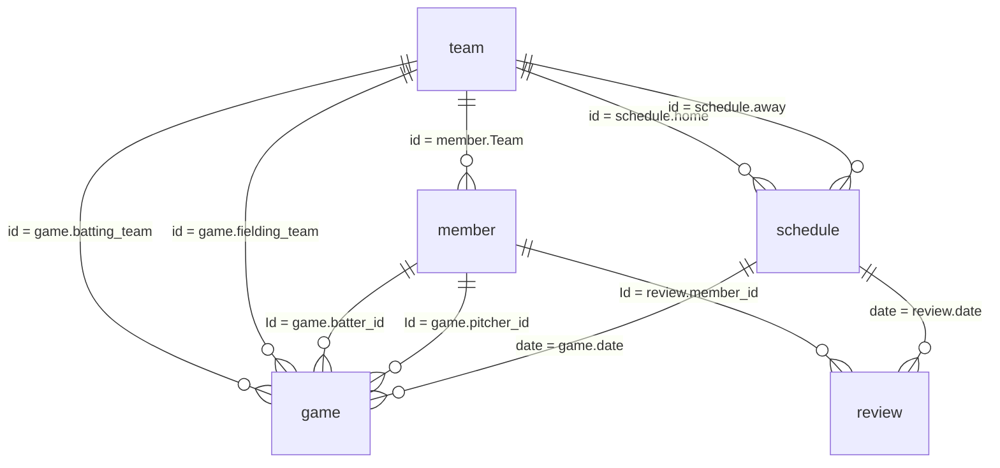

# Supabase 테이블 정보 정리

작성 기준: 2026-06-30, `database/supabase/` export 파일 기준

이 문서는 `database/supabase/`에 저장된 Supabase export 파일을 바탕으로 BTS 프로젝트의 DB 테이블 구조와 실제 데이터 상태를 정리한 문서다. CSV 파일을 기준으로 컬럼, 행 수, 값 분포를 확인했고, SQL 파일은 같은 데이터를 `INSERT INTO public.<table>` 형식으로 복원하기 위한 export로 함께 확인했다.

> 주의: `member.User_PW`는 export에 평문 형태로 들어 있고, `member.Picture`는 긴 base64 이미지 데이터다. 이 문서에는 보안과 가독성을 위해 원본 값 자체를 반복 기록하지 않는다.

## 1. Export 파일 구성

| 테이블 | CSV 파일 | SQL 파일 | 행 수 | 설명 |
| --- | --- | --- | ---: | --- |
| `team` | `team_rows.csv` | `team_rows.sql` | 4 | 팀 기본 정보, 팀 소개, 팀 엠블럼, 팀별 베스트 멤버 라인업 |
| `member` | `member_rows.csv` | `member_rows.sql` | 85 | 선수, 감독, 기록원 계정 및 프로필 정보 |
| `schedule` | `schedule_rows.csv` | `schedule_rows.sql` | 31 | 경기 일정, 홈/원정 팀, 참석 상태, 홈/원정 라인업 |
| `game` | `game_rows.csv` | `game_rows.sql` | 878 | 경기별 타석/플레이 단위 기록 |
| `review` | `review_rows.csv` | `review_rows.sql` | 78 | 선수별 경기 리뷰와 최근/기준 성적 지표 |

추가 파일:

- `README.md`: Supabase SQL 참고 파일 폴더의 목적 설명
- `migrations/0001_create_review_table.sql`: `review` 테이블 생성 migration 후보

## 2. 전체 관계 요약



검증 결과:

- `member.Team` 값은 빈 값 1건을 제외하고 모두 `team.id`에 존재한다.
- `schedule.home`, `schedule.away`는 모두 `team.id`에 존재한다.
- `game.batting_team`, `game.fielding_team`은 모두 `team.id`에 존재한다.
- `game.batter_id`, `game.pitcher_id`는 모두 `member.Id`에 존재한다.
- `game.date`, `review.date`는 모두 `schedule.date`에 존재한다.
- `review.member_id`는 모두 `member.Id`에 존재한다.

## 3. 공통 데이터 규칙

### 날짜

- `schedule.date`, `game.date`, `review.date`는 `YYYYMMDD` 형태의 문자열/숫자형 날짜 key로 사용된다.
- API와 앱 코드에서는 날짜를 문자열로 비교하거나 경로 파라미터로 사용한다.
- `schedule.date`는 일정 조회, 라인업 저장, 리뷰 생성의 기준 key다.

### 팀 ID

- `team.id`는 1부터 4까지의 팀 식별자다.
- `member.Team`, `schedule.home`, `schedule.away`, `game.batting_team`, `game.fielding_team`이 이 값을 참조한다.

### 멤버 ID

- `member.Id`는 0부터 84까지의 사용자/선수 식별자다.
- `game.batter_id`, `game.pitcher_id`, `review.member_id`, 라인업 JSON, 참석 JSON에서 사용된다.

### 라인업 JSON

`team.best_member`, `schedule.home_lineup`, `schedule.away_lineup`은 같은 계열의 JSON 구조를 사용한다.

```json
{
  "batting": [5, 13, 4, 16, 2, 3, 9, 12, 19],
  "defense": {
    "P": 11,
    "C": 5,
    "1B": 13,
    "2B": 3,
    "3B": 4,
    "SS": 9,
    "LF": 12,
    "CF": 2,
    "RF": 19,
    "DH": 16,
    "BENCH": [0, 6, 10]
  }
}
```

- `batting`: 1번부터 9번까지의 타순 멤버 ID 배열이다.
- `defense`: 포지션별 선발 멤버 ID와 후보 `BENCH` 배열을 담는다.
- 포지션 key는 `P`, `C`, `1B`, `2B`, `3B`, `SS`, `LF`, `CF`, `RF`, `DH`, `BENCH`다.

### 참석 JSON

`schedule.home_member`, `schedule.away_member`는 멤버 ID를 문자열 key로 쓰는 JSON object다.

```json
{
  "0": 1,
  "1": 1,
  "2": 0
}
```

- key: `member.Id`
- value `1`: 참석
- value `0`: 불참
- key가 없으면 앱에서는 미응답/대기 상태로 해석한다.

현재 export 기준 참석 값 분포:

- `1`: 1,222건
- `0`: 3건

## 4. `team` 테이블

### 역할

팀의 기본 정보를 담는 마스터 테이블이다. 팀명, 팀 성향 설명, 팀 엠블럼 URL, 감독이 설정한 고정 베스트 멤버 라인업을 저장한다.

### 데이터 현황

| 항목 | 값 |
| --- | --- |
| 행 수 | 4 |
| 팀 ID 범위 | 1-4 |
| 팀 목록 | T1, Dplus Kia, Gen.G, KIWOOM DRX |
| `best_member` 보유 | 3팀 |
| `best_member` 비어 있음 | Dplus Kia |

### 컬럼 상세

| 컬럼 | 추정 타입 | NULL/빈 값 | 의미 | 참조/사용 |
| --- | --- | --- | --- | --- |
| `id` | integer | 없음 | 팀 고유 ID | `member.Team`, `schedule.home`, `schedule.away`, `game.batting_team`, `game.fielding_team`에서 참조 |
| `name` | text | 없음 | 팀 이름 | 화면에서 팀명 표시 |
| `trait` | text | 없음 | 팀 성향/소개 문구 | 팀 정보 화면의 설명 텍스트 |
| `best_member` | json/text | 1건 빈 값 | 팀의 기본 베스트 라인업 | `TeamInfoScreen`, `BestMemberScreen`, `/api/team/{team_id}/best_member` |
| `emblem` | url/text | 없음 | Supabase Storage의 팀 엠블럼 URL | 팀 정보 화면에서 팀 로고로 사용 |

### 팀별 요약

| id | name | 멤버 수 | best_member | emblem 파일 |
| ---: | --- | ---: | --- | --- |
| 1 | T1 | 21 | 있음 | `T1LOGo.svg` |
| 2 | Dplus Kia | 21 | 없음 | `Dplus_Kia_Teamlogo.svg` |
| 3 | Gen.G | 21 | 있음 | `GenG_Team.svg` |
| 4 | KIWOOM DRX | 21 | 있음 | `KiwoomDRX.svg` |

## 5. `member` 테이블

### 역할

앱 사용자와 선수 프로필을 함께 담는 테이블이다. 선수, 감독, 기록원 계정 정보와 포지션, 등번호, 기본 타순, 프로필 이미지가 저장된다.

### 데이터 현황

| 항목 | 값 |
| --- | --- |
| 행 수 | 85 |
| ID 범위 | 0-84 |
| 팀 소속 멤버 | 84명 |
| 팀이 비어 있는 계정 | 1명, 기록원 |
| 감독 계정 | 4명 |
| 기록원 계정 | 1명 |
| `Picture` 보유 | 29명 |
| `Picture` 빈 값 | 56명 |

역할/주 포지션 분포:

| Primary_Position | 건수 |
| --- | ---: |
| C | 14 |
| 1B | 12 |
| LF | 10 |
| 3B | 9 |
| SS | 7 |
| CF | 7 |
| 2B | 6 |
| RF | 6 |
| DH | 5 |
| P | 4 |
| 감독 | 4 |
| 기록원 | 1 |

특수 계정:

| Id | Name | Team | Primary_Position | 비고 |
| ---: | --- | --- | --- | --- |
| 80 | 김동현 | 1 | 감독 | 팀 1 관리자 역할 |
| 81 | 구독자 | 2 | 감독 | 팀 2 관리자 역할 |
| 82 | 유튜버 | 3 | 감독 | 팀 3 관리자 역할 |
| 83 | 김정훈 | 4 | 감독 | 팀 4 관리자 역할 |
| 84 | 장재연 | 빈 값 | 기록원 | 전체 일정/기록 관리 역할 |

`User_ID`와 `User_PW` 원문 값은 보안상 표에 반복 기재하지 않았다.

### 컬럼 상세

| 컬럼 | 추정 타입 | NULL/빈 값 | 의미 | 참조/사용 |
| --- | --- | --- | --- | --- |
| `Id` | integer | 없음 | 멤버 고유 ID | `game.batter_id`, `game.pitcher_id`, `review.member_id`, 라인업/참석 JSON에서 참조 |
| `Team` | integer | 1건 빈 값 | 소속 팀 ID | `team.id` 참조. 기록원 계정은 팀이 비어 있다. |
| `Num` | integer | 5건 빈 값 | 등번호 | 선수 상세/카드 표시 |
| `Name` | text | 없음 | 사용자/선수 이름 | 화면 표시, 리뷰 문구, 카드 합성 |
| `Positions` | json array | 5건 빈 값 | 가능한 포지션 배열 | 예: `["DH","3B"]` |
| `Primary_Position` | text | 없음 | 주 포지션 또는 역할 | 로그인 후 감독/기록원/선수 분기, 선수 역할 표시 |
| `Is_Pitcher` | integer/boolean | 5건 빈 값 | 투수 여부 | 리뷰 모드와 투수 기록 계산에 사용 |
| `Batting_Order_Default` | integer | 5건 빈 값 | 기본 타순 | 라인업/선수 정보 표시 후보 값 |
| `User_ID` | text | 없음 | 로그인 ID | 로그인 화면에서 조회 |
| `User_PW` | text | 없음 | 로그인 비밀번호 | 현재 export에는 평문 값이 들어 있다. 운영에서는 해시 또는 인증 서비스로 대체 필요 |
| `Picture` | text/base64 | 56건 빈 값 | 선수 프로필/AI 생성 이미지 base64 | 선수 상세 화면, PR 카드 생성/저장 흐름 |

### 주의사항

- `User_PW`는 보안상 가장 먼저 개선이 필요한 컬럼이다. 현재 앱 코드에서는 클라이언트에서 `User_ID`, `User_PW`를 직접 비교한다.
- `Picture`는 CSV/SQL 파일 크기의 대부분을 차지한다. 문서나 diff에서는 원문을 직접 다루지 않는 편이 안전하다.
- 감독과 기록원도 같은 `member` 테이블에 들어 있으므로, 선수 통계 계산에서는 `Primary_Position` 기준으로 제외/분기해야 한다.

## 6. `schedule` 테이블

### 역할

경기 일정과 경기별 참석/라인업 상태를 관리한다. 홈팀/원정팀, 삭제 상태, 생성/수정 시각, 홈/원정 참석자 map, 홈/원정 라인업 JSON을 포함한다.

### 데이터 현황

| 항목 | 값 |
| --- | --- |
| 행 수 | 31 |
| 날짜 범위 | 20250303-20261226 |
| 활성 일정 | 28 |
| 삭제 표시 일정 | 3 |
| `home_lineup`/`away_lineup` | 전 행 존재 |
| `home_member`/`away_member` | 전 행 존재 |

매치업 분포:

| 홈팀 | 원정팀 | 경기 수 |
| --- | --- | ---: |
| T1 | Dplus Kia | 5 |
| Gen.G | Dplus Kia | 4 |
| T1 | Gen.G | 3 |
| Gen.G | T1 | 3 |
| Gen.G | KIWOOM DRX | 2 |
| Dplus Kia | KIWOOM DRX | 2 |
| T1 | KIWOOM DRX | 2 |
| Dplus Kia | Gen.G | 2 |
| Dplus Kia | T1 | 2 |
| KIWOOM DRX | Gen.G | 2 |
| KIWOOM DRX | Dplus Kia | 2 |
| KIWOOM DRX | T1 | 2 |

### 컬럼 상세

| 컬럼 | 추정 타입 | NULL/빈 값 | 의미 | 참조/사용 |
| --- | --- | --- | --- | --- |
| `date` | text/date-key | 없음 | 경기 날짜 key, 사실상 일정 식별자 | `game.date`, `review.date`에서 참조. API 경로에도 사용 |
| `home` | integer | 없음 | 홈팀 ID | `team.id` 참조 |
| `away` | integer | 없음 | 원정팀 ID | `team.id` 참조 |
| `home_member` | json object | 없음 | 홈팀 참석 상태 map | `PATCH /api/schedule/attendance`, 선수 일정/라인업 후보 필터 |
| `away_member` | json object | 없음 | 원정팀 참석 상태 map | `PATCH /api/schedule/attendance`, 선수 일정/라인업 후보 필터 |
| `deleted_at` | timestamp/text | 28건 빈 값 | 소프트 삭제 시각 | API 조회에서 `deleted_at is null`로 활성 일정만 사용 |
| `created_at` | timestamp/text | 29건 빈 값 | 일정 생성 시각 | 기록원 일정 등록 흐름 |
| `updated_at` | timestamp/text | 없음 | 일정 수정 시각 | 기록원 화면에서 수정 기록 표시 |
| `home_lineup` | json object | 없음 | 홈팀 라인업 | `LineupScreen`, `MyGameScreen`, `/api/schedule/{date}/lineup?side=home` |
| `away_lineup` | json object | 없음 | 원정팀 라인업 | `LineupScreen`, `MyGameScreen`, `/api/schedule/{date}/lineup?side=away` |

### 주요 사용 흐름

- 기록원: 일정 등록/수정/삭제
- 선수: 본인 팀 일정 조회와 참석 상태 변경
- 감독: 팀 경기 조회, 라인업 편성, 경기 종료 후 리뷰 생성
- 공통: 리그 전체 일정/결과 표시

## 7. `game` 테이블

### 역할

경기 기록의 가장 세부 단위 테이블이다. 한 행은 특정 경기의 특정 이닝/초말/타석 순서에서 발생한 하나의 플레이를 뜻한다. 선수 상세 통계, 리그 일정 점수 집계, 리뷰 지표 계산의 핵심 원천이다.

### 데이터 현황

| 항목 | 값 |
| --- | --- |
| 행 수 | 878 |
| 기록 날짜 수 | 12 |
| 날짜 범위 | 20250310-20250915 |
| 이닝 범위 | 1-7 |
| 총 득점 기록 | 242 |
| 실책 발생 플레이 | 24 |
| 구속 범위 | 70-140 |

상위 결과값:

| result | 건수 |
| --- | ---: |
| 유격수 땅볼 | 184 |
| 중전안타 | 162 |
| 삼진 | 134 |
| 볼넷 | 114 |
| 중견수 뜬공 | 88 |
| 좌중간 2루타 | 52 |
| 좌월 홈런 | 36 |
| 2루수 땅볼 | 26 |
| 유격수 실책 출루 | 22 |
| 우익선상 3루타 | 10 |

팀별 공격 기록 수:

| 팀 | 타격 기록 수 |
| --- | ---: |
| T1 | 214 |
| Dplus Kia | 230 |
| Gen.G | 224 |
| KIWOOM DRX | 210 |

### 컬럼 상세

| 컬럼 | 추정 타입 | NULL/빈 값 | 의미 | 참조/사용 |
| --- | --- | --- | --- | --- |
| `id` | integer | 없음 | 플레이 기록 고유 ID | 행 식별자 |
| `date` | text/date-key | 없음 | 경기 날짜 key | `schedule.date` 참조 |
| `inning` | integer | 없음 | 이닝 번호 | 1-7 |
| `half` | integer | 없음 | 초/말 구분 | 코드상 1/2로 사용 |
| `seq` | integer | 없음 | 해당 half inning 안의 플레이 순서 | 같은 이닝 내 정렬 |
| `batting_team` | integer | 없음 | 공격 팀 ID | `team.id` 참조 |
| `fielding_team` | integer | 없음 | 수비 팀 ID | `team.id` 참조 |
| `batter_id` | integer | 없음 | 타자 멤버 ID | `member.Id` 참조 |
| `pitcher_id` | integer | 없음 | 투수 멤버 ID | `member.Id` 참조 |
| `result` | text | 없음 | 타석/플레이 결과 | 안타, 볼넷, 삼진, 땅볼, 홈런 등 |
| `outs_before` | integer | 없음 | 플레이 전 아웃 카운트 | 통계/이닝 진행 계산 |
| `outs_after` | integer | 없음 | 플레이 후 아웃 카운트 | 투수 이닝/아웃 기록 계산 |
| `bases_before` | integer/text-code | 없음 | 플레이 전 주자 상태 code | 0, 1, 10, 11, 100, 101, 110, 111 |
| `bases_after` | integer/text-code | 없음 | 플레이 후 주자 상태 code | 0, 1, 10, 11, 100, 101, 110, 111 |
| `runs_scored_on_play` | integer | 없음 | 해당 플레이 득점 수 | 경기 점수, 타점/실점 계산 |
| `error_on_play` | integer/boolean | 없음 | 실책 여부 | 0/1 |
| `ball_speed` | integer | 없음 | 투구/타구 관련 속도 값 | 선수 상세/기록 표시 후보 |

### 베이스 상태 코드 해석

`bases_before`, `bases_after`는 숫자처럼 보이지만 주자 점유 상태를 표현하는 code로 보는 것이 안전하다.

| 코드 | 의미 |
| --- | --- |
| `0` | 주자 없음 |
| `1` | 1루 주자 |
| `10` | 2루 주자 |
| `11` | 1, 2루 주자 |
| `100` | 3루 주자 |
| `101` | 1, 3루 주자 |
| `110` | 2, 3루 주자 |
| `111` | 만루 |

## 8. `review` 테이블

### 역할

선수별 경기 리뷰 결과를 저장한다. 최근 경기 지표와 이전 경기 baseline을 비교해 생성한 리뷰 메시지, 이슈 목록, 지표 JSON을 보관한다.

### 데이터 현황

| 항목 | 값 |
| --- | --- |
| 행 수 | 78 |
| ID 범위 | 122-208 |
| 리뷰 대상 선수 수 | 48 |
| 리뷰 날짜 수 | 6 |
| 날짜 범위 | 20250512-20250915 |
| HITTER 리뷰 | 68 |
| PITCHER 리뷰 | 10 |

날짜별 리뷰 수:

| date | 리뷰 수 |
| --- | ---: |
| 20250908 | 18 |
| 20250915 | 16 |
| 20250609 | 14 |
| 20250512 | 10 |
| 20250811 | 10 |
| 20250818 | 10 |

### 컬럼 상세

| 컬럼 | 추정 타입 | NULL/빈 값 | 의미 | 참조/사용 |
| --- | --- | --- | --- | --- |
| `id` | integer | 없음 | 리뷰 고유 ID | `review` 테이블 primary key |
| `member_id` | integer | 없음 | 리뷰 대상 멤버 ID | `member.Id` 참조 |
| `date` | text/date-key | 없음 | 리뷰 기준 경기 날짜 | `schedule.date` 참조 |
| `mode` | text | 없음 | 리뷰 모드 | `HITTER` 또는 `PITCHER` |
| `message` | text | 없음 | 사용자에게 보여줄 리뷰 본문 | 선수 상세 화면의 리뷰 카드 |
| `issues` | json array | 없음 | 보완 포인트 목록 | 리뷰 생성 로직의 이슈 결과 |
| `baseline_metrics` | json object | 없음 | 이전 경기 기준 지표 | 최근 경기와 비교하는 기준값 |
| `recent_metrics` | json object | 없음 | 최근 경기 지표 | 리뷰 기준 경기의 실제 지표 |
| `created_at` | timestamptz/text | 없음 | 리뷰 생성 시각 | migration 기본값 `now()` |
| `updated_at` | timestamptz/text | 없음 | 리뷰 수정 시각 | migration 기본값 `now()` |

### metric JSON 구조

타자 리뷰에서 주로 쓰는 key:

- `ops`
- `hits`
- `walks`
- `at_bats`
- `average`
- `on_base`
- `slugging`
- `home_runs`
- `strikeouts`
- `runs_batted_in`

투수 리뷰에서 주로 쓰는 key:

- `era`
- `whip`
- `walks`
- `k_per_9`
- `strikeouts`
- `hits_allowed`
- `runs_allowed`
- `outs_recorded`
- `innings_pitched`

### migration 기준 제약

`migrations/0001_create_review_table.sql` 기준으로 `review` 테이블은 다음 제약을 갖는다.

- `id`: identity primary key
- `member_id`: `public.member("Id")` 참조
- `date`: `public.schedule(date)` 참조
- `issues`: `jsonb not null default '[]'`
- `baseline_metrics`: `jsonb not null default '{}'`
- `recent_metrics`: `jsonb not null default '{}'`
- `created_at`, `updated_at`: `timestamptz not null default now()`
- unique index: `(member_id, date)`
- index: `date`

## 9. 테이블별 앱/백엔드 사용 위치

| 테이블 | 주요 사용 위치 | 사용 목적 |
| --- | --- | --- |
| `team` | `apps/api/main.py`, `apps/api/review_logic.py`, `TeamInfoScreen.js`, `ManagerScheduleScreen.js` | 팀 목록/상세 조회, 팀명 표시, 베스트 멤버 저장, 리뷰 문구의 팀명 조회 |
| `member` | `LoginScreen.js`, `MainTabNavigator.js`, `CommonFooter.js`, `PlayerDetailScreen.js`, `apps/api/main.py`, `review_logic.py` | 로그인, 역할 분기, 선수 프로필, 선수 통계 대상, 리뷰 대상 |
| `schedule` | `PlayerScheduleScreen.js`, `DirectorScheduleScreen.js`, `LeagueGameScheduleScreen.js`, `ManagerScheduleScreen.js`, `LineupScreen.js`, `MyGameScreen.js`, `apps/api/main.py` | 일정 조회/등록/수정/삭제, 참석 관리, 라인업 저장/조회 |
| `game` | `PlayerDetailScreen.js`, `LeagueGameScheduleScreen.js`, `DirectorScheduleScreen.js`, `review_logic.py` | 선수 성적 계산, 경기 점수 집계, 리뷰 지표 생성 |
| `review` | `PlayerDetailScreen.js`, `apps/api/main.py`, `review_logic.py`, `review/service.py` | 선수 리뷰 조회/생성/저장 |

## 10. 운영/개선 관점 메모

1. 인증 정보 분리 필요
   - `member.User_PW`가 평문으로 export되어 있다.
   - Supabase Auth 또는 백엔드 인증 API로 분리하고, 비밀번호는 해시/인증 서비스로 관리하는 것이 안전하다.

2. 대용량 이미지 저장 방식 개선 필요
   - `member.Picture`에 base64 이미지가 직접 들어 있어 CSV/SQL export가 커진다.
   - Supabase Storage URL만 DB에 저장하는 방식이 더 관리하기 쉽다.

3. schema migration 보강 필요
   - 현재 migration 파일은 `review` 테이블만 있다.
   - `team`, `member`, `schedule`, `game`의 DDL도 migration으로 보관하면 재현성이 좋아진다.

4. JSON 컬럼 규격 문서화 필요
   - `best_member`, `home_lineup`, `away_lineup`, `home_member`, `away_member`는 앱 로직과 강하게 결합되어 있다.
   - JSON schema 또는 타입 정의를 별도로 두면 라인업/참석 기능 변경 시 안전하다.

5. 소프트 삭제 기준 명확화 필요
   - `schedule.deleted_at`이 있는 일정은 API에서 제외된다.
   - 리포트나 통계에서 삭제 일정을 포함할지 제외할지 기준을 명확히 해야 한다.
