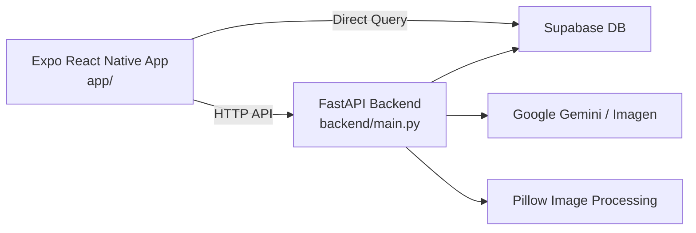

# BTS 프로젝트 폴더 구조 및 파일 역할 정리

작성 기준: 2026-06-27 현재 `/Users/company/Desktop/main` 작업트리 기준.  
목적: 이후 전체 프로젝트 리팩토링을 진행하기 전에, 현재 구조와 파일별 책임을 빠르게 파악하기 위한 인벤토리 문서.

> 참고: 이 문서는 `apps/mobile`, `apps/api`, `docs`, `database` 구조로 이동하기 전의 기준 스냅샷이다. 리팩토링 이후의 실행 경로는 루트 `README.md`와 `docs/refactor/project_restructure_plan.md`를 우선 확인한다.

## 1. 프로젝트 전체 요약

BTS(Baseball Team System)는 사회인 야구팀 운영을 위한 모바일 앱 프로젝트다. 저장소는 하나의 루트 안에 Expo React Native 앱, FastAPI 백엔드, Supabase 연동 코드, 발표/기획 문서를 함께 둔 단일 저장소 구조다.

현재 구조의 큰 흐름은 다음과 같다.



주요 특징:

- `app/`: Expo React Native 모바일 앱. 화면, 내비게이션, Supabase 클라이언트, API 호출 로직을 포함한다.
- `backend/`: FastAPI 서버. 일정/멤버/팀/라인업/리뷰/AI 이미지/CSV 업로드 API를 제공한다.
- `report_md/`: 발표, 배포, 사용자 흐름, 기여 정리용 Markdown 문서 모음이다.
- 루트 Markdown 문서: 프로젝트 기획, 유저스토리, README, PR 템플릿을 담는다.
- 데이터 접근 방식: 앱이 일부 데이터는 Supabase에 직접 접근하고, 일부 기능은 FastAPI를 경유한다.

## 2. 현재 전체 폴더 트리

아래 트리는 `.git/`, `node_modules/`, 캐시/빌드 산출물을 제외하고 현재 파일 시스템에서 확인되는 파일 기준이다.

```text
main/
├─ .DS_Store
├─ .env
├─ .gitignore
├─ BTS_project_overview.md
├─ BTS_user_stories.md
├─ README.md
├─ project_structure.md
├─ pull_request_template.md
├─ app/
│  ├─ .gitignore
│  ├─ App.js
│  ├─ app.json
│  ├─ babel.config.js
│  ├─ index.js
│  ├─ metro.config.js
│  ├─ package-lock.json
│  ├─ package.json
│  ├─ assets/
│  │  ├─ adaptive-icon.png
│  │  ├─ baseballStadium.jpg
│  │  ├─ favicon.png
│  │  ├─ icon.png
│  │  └─ splash-icon.png
│  ├─ components/
│  │  ├─ CommonFooter.js
│  │  └─ CommonHeader.js
│  ├─ constants/
│  │  ├─ commonConstants.js
│  │  └─ scheduleConstants.js
│  ├─ designReference/
│  │  └─ DESIGN.md
│  ├─ lib/
│  │  └─ supabase.js
│  ├─ navigation/
│  │  └─ MainTabNavigator.js
│  ├─ screen/
│  │  ├─ BestMemberScreen.js
│  │  ├─ bestMemberScreen.styles.js
│  │  ├─ directorScheduleScreen.js
│  │  ├─ directorScheduleScreen.styles.js
│  │  ├─ leagueGameScheduleScreen.js
│  │  ├─ leagueGameScheduleScreen.styles.js
│  │  ├─ lineupScreen.js
│  │  ├─ lineupScreen.styles.js
│  │  ├─ loginScreen.js
│  │  ├─ loginScreen.styles.js
│  │  ├─ managerScheduleScreen.js
│  │  ├─ managerScheduleScreen.styles.js
│  │  ├─ myGameScreen.js
│  │  ├─ myGameScreen.styles.js
│  │  ├─ playerDetailScreen.js
│  │  ├─ playerDetailScreen.styles.js
│  │  ├─ playerScheduleScreen.js
│  │  ├─ playerScheduleScreen.styles.js
│  │  ├─ teamInfoScreen.js
│  │  └─ teamInfoScreen.styles.js
│  ├─ supabaseDataReference/
│  │  └─ review_table.sql
│  └─ utils/
│     ├─ dataCall.js
│     └─ scheduleUtils.js
├─ backend/
│  ├─ .env
│  ├─ main.py
│  ├─ requirements.txt
│  ├─ review_logic.py
│  └─ review/
│     ├─ prompts.py
│     ├─ rules.py
│     └─ service.py
└─ report_md/
   ├─ 01_directory_structure.md
   ├─ 02_user_flow_mermaid.md
   ├─ 03_README.md
   ├─ 04_deployment_guide.md
   ├─ 05_technical_presentation_topics.md
   ├─ 06_presentation_suggestions.md
   └─ 07_contributor_work_summary.md
```

## 3. 루트 파일 역할

### `.DS_Store`

macOS Finder가 생성한 로컬 메타데이터 파일이다. 애플리케이션 실행에는 필요하지 않다. 현재 Git 미추적 파일로 보이며, 리팩토링 전 `.gitignore`에서 확실히 제외하거나 삭제 후보로 볼 수 있다.

### `.env`

루트 로컬 환경 변수 파일이다. 현재 `.gitignore`에 의해 제외되는 파일이다. 민감값을 담을 수 있으므로 문서에는 값 자체를 기록하지 않는다. 현재 코드 기준으로 앱은 주로 `app/constants/commonConstants.js`, `app/lib/supabase.js`의 하드코딩 값을 사용하므로, 루트 `.env`가 실제 런타임에서 어디까지 쓰이는지는 별도 확인이 필요하다.

### `.gitignore`

루트 Git 제외 규칙 파일이다. 현재 `__pycache__/*`, `.env`를 제외한다. `app/.gitignore`가 Expo/Node 관련 제외 규칙을 더 많이 갖고 있으므로, 저장소 전체 기준으로는 루트 `.gitignore` 보강 여지가 있다.

### `README.md`

프로젝트 대표 안내 문서다. 프로젝트 개요, 기술 스택, 주요 기능, 앱 화면 구성, 백엔드 API 요약, 실행 방법, 설정 주의사항을 담는다. 다만 현재 작업트리 기준으로 루트 `package.json`, `package-lock.json`, `implementation_plan.md`는 삭제 상태라 README의 일부 구조 설명은 갱신이 필요하다.

### `BTS_project_overview.md`

프로젝트 기획서다. 문제 정의, 사용자 역할(감독/선수/기록원), MVP 범위, MoSCoW 우선순위, 화면 구성, AI 라인업 추천 아이디어, 데이터 관리 초안을 정리한다. 구현 코드보다 기획 범위를 더 넓게 담고 있어, 구현 여부 확인 없이 그대로 기능 목록으로 쓰면 과장될 수 있다.

### `BTS_user_stories.md`

기획서를 바탕으로 만든 유저스토리 문서다. 인증/권한, 일정 관리, 출석 관리, 라인업, 선수 정보, CSV 업로드, 대시보드 조회 Epic과 스토리포인트를 정리한다. 리팩토링 시 기능 단위 작업 목록을 다시 자를 때 기준 문서로 활용할 수 있다.

### `pull_request_template.md`

PR 작성용 템플릿이다. 변경 사항, 작업 목록, 스크린샷 영역을 제공한다. 현재 형식은 간단한 체크리스트 수준이며, 테스트 방법/영향 범위/리스크 항목을 추가하면 협업 품질을 올릴 수 있다.

### `project_structure.md`

현재 문서다. 전체 프로젝트 구조, 파일별 역할, 현재 구조의 리팩토링 포인트를 정리한다. 이후 리팩토링 전에 현황 파악용 기준 문서로 사용한다.

## 4. `app/` 모바일 앱 구조

`app/`는 Expo React Native 앱의 실제 실행 루트다. `package.json`과 Expo 설정이 이 폴더 안에 있으므로 프론트엔드 실행은 루트가 아니라 `app/`에서 한다.

실행 관련 명령:

```bash
cd app
npm install
npm run start
```

### 4.1 앱 진입점 및 설정 파일

#### `app/package.json`

프론트엔드 앱의 Node 패키지 정의 파일이다.

주요 역할:

- 앱 이름 `bts-app`, 버전, 엔트리 `index.js` 정의
- Expo 실행 스크립트 제공
  - `npm run start`
  - `npm run android`
  - `npm run ios`
  - `npm run web`
- 주요 의존성 관리
  - Expo 54
  - React Native 0.81
  - React 19
  - React Navigation
  - Supabase JS Client
  - Expo File System / Media Library / Asset
  - react-native-svg

#### `app/package-lock.json`

`app/package.json` 기준으로 설치된 npm 의존성의 정확한 버전을 고정하는 lock 파일이다. 팀원/CI 환경에서 동일한 패키지 트리를 재현하기 위해 필요하다.

#### `app/app.json`

Expo 앱 메타데이터 설정 파일이다.

주요 역할:

- 앱 이름/slug/version 설정
- 세로 방향 고정
- 앱 아이콘, splash 이미지, adaptive icon, web favicon 지정
- iOS tablet 지원 여부 설정
- Android edge-to-edge 설정
- `expo-asset` 플러그인 등록

#### `app/index.js`

Expo 앱의 JS 엔트리 등록 파일이다. `registerRootComponent(App)`를 호출해서 `App.js`를 Expo/React Native 런타임의 루트 컴포넌트로 등록한다.

#### `app/App.js`

앱 최상위 컴포넌트다.

주요 역할:

- `SafeAreaProvider` 적용
- `NavigationContainer` 구성
- 최상위 Stack Navigator 생성
- 첫 화면을 `Login`으로 설정
- 로그인 이후 진입 화면인 `MainTab` 연결

현재 앱의 최상위 라우팅은 `LoginScreen -> MainTabNavigator` 흐름으로 단순하게 잡혀 있다.

#### `app/babel.config.js`

Expo용 Babel 설정 파일이다. `babel-preset-expo`를 사용한다. 별도 플러그인은 현재 없다.

#### `app/metro.config.js`

Metro bundler 설정 파일이다.

주요 역할:

- Expo 기본 Metro 설정을 가져온다.
- resolver의 source extension에 `ts`, `tsx`, `svg`를 추가한다.
- `resolverMainFields`를 `sbmodern`, `browser`, `main` 순서로 지정한다.

현재 코드 대부분은 JS지만, 설정상 TypeScript 파일을 해석할 여지가 열려 있다.

#### `app/.gitignore`

앱 폴더 기준 Git 제외 규칙이다. `node_modules/`, `.expo/`, `dist/`, `web-build/`, native 빌드 산출물, debug 로그, local env, TypeScript build info, generated native folders 등을 제외한다.

### 4.2 정적 자산

#### `app/assets/adaptive-icon.png`

Android adaptive icon foreground image로 사용된다. `app/app.json`의 `android.adaptiveIcon.foregroundImage`에서 참조한다.

#### `app/assets/baseballStadium.jpg`

야구장 배경 이미지 자산이다. 현재 코드에서는 일부 화면이 외부 URL 야구장 이미지를 직접 쓰고 있어, 이 로컬 이미지가 실제 화면에서 사용되는지는 추가 확인이 필요하다. 리팩토링 시 로컬 자산 사용 여부를 정리할 후보 파일이다.

#### `app/assets/favicon.png`

Expo web 실행 시 favicon으로 쓰이는 이미지다. `app/app.json`의 `web.favicon`에서 참조한다.

#### `app/assets/icon.png`

앱 기본 아이콘이다. `app/app.json`의 `icon`에서 참조한다.

#### `app/assets/splash-icon.png`

앱 시작 splash 화면 이미지다. `app/app.json`의 `splash.image`에서 참조한다.

### 4.3 공통 컴포넌트

#### `app/components/CommonHeader.js`

여러 화면에서 재사용하는 상단 헤더 컴포넌트다.

주요 역할:

- 화면 제목을 상단 바에 표시한다.
- `playerDetailScreen`, `managerScheduleScreen` 제목일 때 로그아웃 버튼을 표시한다.
- 로그아웃 시 navigation stack을 `Login`으로 reset한다.

리팩토링 관점:

- 제목 문자열로 로그아웃 표시 여부를 판별한다.
- 화면명/표시명/권한 액션이 섞여 있으므로 prop 기반 옵션으로 분리할 수 있다.

#### `app/components/CommonFooter.js`

역할별 하단 탭 UI를 직접 렌더링하는 공통 푸터 컴포넌트다.

주요 역할:

- 로그인 사용자 ID와 포지션을 받아 하단 메뉴를 구성한다.
- 감독이면 `팀일정`, `팀정보`, `리그일정`, `유저정보` 탭을 보여준다.
- 일반 선수면 `내경기`, `일정관리`, `팀정보`, `리그일정`, `내정보` 탭을 보여준다.
- Supabase에서 `member.Primary_Position`을 다시 조회해 역할을 보정한다.
- `MaterialCommunityIcons`를 사용해 탭 아이콘을 표시한다.
- safe area inset을 반영해 하단 여백을 조정한다.

리팩토링 관점:

- 역할 정보가 `MainTabNavigator.js`와 `CommonFooter.js`에서 중복 조회된다.
- 탭 구성 데이터와 UI 렌더링을 분리하면 테스트와 변경이 쉬워진다.

### 4.4 상수 파일

#### `app/constants/commonConstants.js`

공통 환경 상수를 담는다.

현재 내용:

- `API_BASE_URL = "http://172.30.1.19:8000"`

리팩토링 관점:

- 백엔드 주소가 로컬 IP로 하드코딩되어 있다.
- 배포/팀원 로컬 실행/시뮬레이터 환경 전환을 위해 `EXPO_PUBLIC_API_BASE_URL` 같은 환경 변수 기반으로 바꾸는 것이 좋다.

#### `app/constants/scheduleConstants.js`

일정, 팀, 멤버, 경기, 출석, 라인업 관련 공통 상수를 담는다.

주요 내용:

- API endpoint 상수
  - `/api/schedule`
  - `/api/team`
  - `/api/member`
  - `/api/game`
- 요일 라벨
- 구장 링크
- 참석 상태 옵션
  - `attending`
  - `pending`
  - `absent`
- 야구 포지션 목록
- 타순 목록
- 초기 라인업 구조
  - `defense`
  - `batting`
  - `BENCH`

리팩토링 관점:

- 라인업 관련 상수와 일정 API endpoint가 한 파일에 같이 있다.
- 도메인별로 `apiConstants`, `lineupConstants`, `attendanceConstants`로 나누면 응집도가 좋아진다.

### 4.5 디자인 참고 문서

#### `app/designReference/DESIGN.md`

앱 디자인 방향을 정리한 문서다.

주요 내용:

- 디자인 키워드: `Rooted Warmth`
- 주요 색상
  - Forest green `#4a7c59`
  - Warm cream `#faf6f0`
  - Warm amber `#705c30`
- 타이포그래피 방향
- 부드러운 그림자/카드/입력 컴포넌트 규칙

리팩토링 관점:

- 실제 RN 스타일 파일 곳곳에 색상 값이 직접 흩어져 있다.
- 디자인 토큰 파일로 승격하면 화면 스타일 통일성이 좋아진다.

### 4.6 외부 서비스 클라이언트

#### `app/lib/supabase.js`

Supabase JS Client 생성 파일이다.

주요 역할:

- `@supabase/supabase-js`의 `createClient`를 호출한다.
- Supabase URL과 publishable anon key를 사용해 `supabase` 객체를 export한다.
- 로그인, 역할 조회, 팀/멤버/게임 일부 직접 조회에 사용된다.

리팩토링 관점:

- Supabase URL과 anon key가 코드에 직접 들어 있다.
- 앱이 Supabase에 직접 접근하는 흐름과 FastAPI를 거치는 흐름이 혼재한다.
- 인증/권한/감사 로그 정책을 정하려면 데이터 접근 경계를 다시 설계해야 한다.

### 4.7 내비게이션

#### `app/navigation/MainTabNavigator.js`

로그인 이후 앱의 핵심 내비게이션 파일이다.

주요 역할:

- `route.params.id`로 현재 로그인 사용자 ID를 받는다.
- Supabase `member` 테이블에서 `Primary_Position`을 조회한다.
- 역할별로 탭 구성을 분기한다.
- 각 탭을 Stack Navigator로 감싸 내부 화면 이동을 구성한다.

구성하는 스택:

- `MyGameStack`
  - `MyGameScreen`
  - `LineupScreen`
  - `ManagerScheduleScreen`
  - `PlayerDetailScreen`
- `ScheduleStack`
  - 감독이면 `DirectorScheduleScreen`
  - 일반 선수면 `PlayerScheduleScreen`
  - 공통으로 `LineupScreen`
- `TeamStack`
  - `TeamInfoScreen`
  - `PlayerDetailScreen`
  - `BestMemberScreen`
- `LeagueStack`
  - `LeagueGameScheduleScreen`
- `ProfileStack`
  - `PlayerDetailScreen`

역할별 특징:

- 감독: 감독 일정 화면을 탭에 포함한다.
- 선수: 선수 일정 화면과 리그 일정 화면을 탭에 포함한다.
- 기록원: 하단 푸터를 숨기는 방식으로 처리된다.

리팩토링 관점:

- 파일 import에서 `BestMemberScreen.js`의 실제 파일명 대소문자와 import 경로 대소문자가 다르다. Linux 기반 CI/CD에서 문제가 될 수 있다.
- 역할 기반 라우팅 정의를 별도 설정 객체로 분리하면 가독성과 테스트성이 좋아진다.

### 4.8 화면 파일

`app/screen/`은 화면별 UI와 비즈니스 로직을 함께 담는다. 대부분 `화면.js`와 `화면.styles.js`가 한 쌍이다.

#### `app/screen/loginScreen.js`

로그인 화면이다.

주요 역할:

- 사용자 ID와 비밀번호 입력을 받는다.
- Supabase `member` 테이블에서 `User_ID`, `User_PW`, `Primary_Position`을 조회한다.
- 비밀번호 일치 여부를 클라이언트에서 검사한다.
- 역할에 따라 `MainTab`으로 reset navigation을 수행한다.
- 개발/시연용 Quick Login ID 선택 모달을 제공한다.
- 기록원 전용 `Manager Login` 진입 버튼을 제공한다.

리팩토링 관점:

- 비밀번호 비교가 클라이언트에서 직접 이루어진다.
- 테스트 로그인 기능과 실제 로그인 기능이 같은 화면에 섞여 있다.
- 인증은 Supabase Auth 또는 백엔드 인증 API로 분리하는 것이 좋다.

#### `app/screen/loginScreen.styles.js`

로그인 화면 전용 스타일 파일이다. 로그인 박스, 입력 필드, 버튼, ID 선택 모달 스타일을 정의한다.

#### `app/screen/myGameScreen.js`

로그인 사용자의 팀 경기와 현재 라인업을 보여주는 화면이다.

주요 역할:

- 일정, 팀, 멤버 데이터를 FastAPI에서 병렬 조회한다.
- 현재 로그인 멤버의 소속 팀을 기준으로 관련 경기와 다가오는 경기를 찾는다.
- 홈/원정 여부에 따라 `home_lineup` 또는 `away_lineup`을 파싱한다.
- 수비 라인업, 벤치, 참석 로스터를 구성한다.
- DiceBear SVG 아바타와 야구장 배경 UI를 사용해 라인업을 시각화한다.
- 선수 카드를 누르면 `PlayerDetail`로 이동한다.

리팩토링 관점:

- 날짜 파싱, JSON 파싱, 라인업 정규화 로직이 화면 내부에 있다.
- `scheduleUtils.js`로 공통화 가능한 로직이 일부 중복된다.

#### `app/screen/myGameScreen.styles.js`

`myGameScreen.js` 전용 스타일이다. 야구장 배경, 포지션 슬롯, 경기 요약, 선수/벤치 리스트 등의 레이아웃과 색상을 정의한다.

#### `app/screen/playerScheduleScreen.js`

선수용 일정/참석 관리 화면이다.

주요 역할:

- 현재 사용자 정보, 전체 일정, 팀 목록을 FastAPI에서 조회한다.
- 사용자의 팀 또는 attendance JSON에 포함된 일정을 필터링한다.
- 향후 경기만 시간순으로 정렬한다.
- 캘린더 형태로 일정 상태를 표시한다.
- 경기별 참석 상태를 `attending`, `absent`, `pending`으로 표시한다.
- 참석 상태 변경 시 `PATCH /api/schedule/attendance`를 호출한다.
- 월 이동과 탭/리스트 전환에 Animated/PanResponder를 사용한다.

리팩토링 관점:

- 일정 정규화 로직이 `scheduleUtils.js`와 일부 겹친다.
- attendance JSON 구조를 화면에서 직접 해석한다.

#### `app/screen/playerScheduleScreen.styles.js`

선수 일정 화면 전용 스타일이다. 캘린더, 경기 카드, 참석 상태 버튼, 로딩/에러 UI를 정의한다.

#### `app/screen/directorScheduleScreen.js`

감독용 일정 화면이다.

주요 역할:

- Supabase에서 현재 감독의 팀 ID를 조회한다.
- 전체 일정, 팀, 경기 기록을 FastAPI에서 조회한다.
- 경기 기록의 득점을 집계해 경기 결과 점수를 만든다.
- 감독 소속 팀 경기를 식별해 강조한다.
- 미래/과거 경기 탭과 월 캘린더 UI를 제공한다.
- 예정 경기에서는 `LineupScreen`으로 이동할 수 있다.
- 종료 경기에서는 `POST /api/review/generate-by-date`를 호출해 팀 리뷰를 생성한다.

리팩토링 관점:

- `leagueGameScheduleScreen.js`와 날짜 파싱, 점수 집계, 캘린더/탭 애니메이션 로직이 매우 유사하다.
- 감독 전용 차이만 분리하고 공통 일정 리스트 컴포넌트로 합칠 수 있다.

#### `app/screen/directorScheduleScreen.styles.js`

현재 빈 스타일 객체만 export한다. 실제 `directorScheduleScreen.js`는 `leagueGameScheduleScreen.styles.js`를 import해 스타일을 공유한다. 리팩토링 시 삭제하거나 명시적으로 공통 스타일 파일명을 바꾸는 것이 좋다.

#### `app/screen/leagueGameScheduleScreen.js`

리그 전체 경기 일정/결과 조회 화면이다.

주요 역할:

- 일정, 팀, 경기 기록을 FastAPI에서 조회한다.
- `game` rows의 `runs_scored_on_play`를 팀/날짜별로 집계해 점수 맵을 만든다.
- 일정 row를 화면 표시용 경기 객체로 정규화한다.
- 미래/과거 경기 탭을 제공한다.
- 월 캘린더와 스와이프/애니메이션 기반 화면 전환을 처리한다.
- 더 보기 기능으로 일정 목록 표시 수를 늘린다.

리팩토링 관점:

- 감독 일정 화면과 공통 로직이 많다.
- 날짜/점수/팀명 정규화 유틸을 분리하면 중복이 줄어든다.

#### `app/screen/leagueGameScheduleScreen.styles.js`

리그 일정 화면과 감독 일정 화면이 함께 사용하는 스타일 파일이다. 캘린더, 탭, 경기 카드, 점수 표시, 상태 메시지, 액션 버튼 스타일을 정의한다.

#### `app/screen/managerScheduleScreen.js`

기록원/관리자용 일정 CRUD 화면이다.

주요 역할:

- FastAPI에서 전체 일정 목록을 조회한다.
- Supabase에서 팀 목록을 직접 조회해 팀 ID와 이름 맵을 만든다.
- 캘린더에서 날짜를 선택한다.
- 홈팀/원정팀을 선택한다.
- 새 일정 등록, 기존 일정 수정, 삭제를 처리한다.
- 과거 날짜 등록과 동일 팀 매칭을 차단한다.
- 네트워크 요청 timeout을 일부 적용한다.

연결 API:

- `GET /api/schedule`
- `POST /api/schedule`
- `PUT /api/schedule/{date}`
- `DELETE /api/schedule/{date}`

리팩토링 관점:

- 일정 CRUD는 `scheduleUtils.js` 일부와 연결되어 있지만 화면 내부 로직도 많다.
- 팀 조회는 Supabase 직접 접근, 일정 조회/저장은 FastAPI 접근이라 데이터 경계가 섞여 있다.

#### `app/screen/managerScheduleScreen.styles.js`

관리자 일정 화면 전용 스타일이다. 캘린더, 팀 선택 드롭다운, 일정 카드, 등록/수정/삭제 버튼, 로딩/에러 UI를 정의한다.

#### `app/screen/lineupScreen.js`

감독이 특정 경기의 라인업을 편성하는 화면이다.

주요 역할:

- `targetDate` 기준으로 일정 상세를 조회한다.
- 전체 멤버를 조회한다.
- 현재 로그인 사용자의 팀이 홈/원정 중 어디인지 판단한다.
- 해당 팀의 참석자만 후보로 만든다.
- `home_lineup` 또는 `away_lineup`을 파싱해 현재 라인업을 불러온다.
- 수비 포지션 탭과 타순 탭을 제공한다.
- 포지션 중복 배정을 방지한다.
- 후보(BENCH) 일괄 등록을 지원한다.
- DH가 있을 때 투수가 타순에 들어가지 않도록 제한한다.
- 수비에서 빠진 선수는 타순에서도 제거한다.
- 저장 시 `POST /api/schedule/{targetDate}/lineup?side=home|away`를 호출한다.

리팩토링 관점:

- 라인업 규칙이 화면 컴포넌트 내부에 들어 있다.
- `assignMember`, `handleAutoBench`, 타순 동기화 규칙은 순수 함수로 분리해 테스트 가능하게 만드는 것이 좋다.

#### `app/screen/lineupScreen.styles.js`

라인업 화면 전용 스타일이다. 수비/타순 탭, 야구장 포지션 배치, 후보 선수 목록, 저장 버튼, 선수 슬롯 UI를 정의한다.

#### `app/screen/teamInfoScreen.js`

팀 정보와 팀원 목록을 보여주는 화면이다.

주요 역할:

- 전체 멤버를 FastAPI에서 조회한다.
- 로그인 사용자의 팀 ID를 기준으로 팀 상세 정보를 조회한다.
- 팀 로고/설명/이름을 표시한다.
- `team.best_member`를 파싱해 베스트 라인업을 보여준다.
- 팀원 목록을 등번호 기준으로 정렬해 보여준다.
- 감독이면 `BestMemberScreen` 관리 화면으로 이동할 수 있다.
- 팀원 또는 포지션 슬롯을 누르면 `PlayerDetail`로 이동한다.

리팩토링 관점:

- 팀원 필터링, best_member 구조 보정 로직이 `BestMemberScreen.js`와 일부 겹친다.

#### `app/screen/teamInfoScreen.styles.js`

팀 정보 화면 전용 스타일이다. 팀 카드, 로고 영역, 베스트 라인업 야구장 UI, 로스터 그리드, 선수 카드 스타일을 정의한다.

#### `app/screen/BestMemberScreen.js`

감독이 팀의 고정 베스트 멤버를 설정하는 화면이다.

주요 역할:

- 전체 멤버를 조회한다.
- 현재 사용자와 팀 정보를 조회한다.
- 기존 `team.best_member` 데이터를 파싱하고 구조를 보정한다.
- 수비 포지션과 타순을 설정한다.
- 후보(BENCH) 등록을 지원한다.
- 수비/타순 중복과 DH/투수 타순 제한을 적용한다.
- 감독만 저장할 수 있도록 클라이언트에서 권한을 확인한다.
- 저장 시 `POST /api/team/{team_id}/best_member`를 호출한다.

리팩토링 관점:

- `lineupScreen.js`와 매우 비슷한 라인업 편성 로직을 가진다.
- 경기별 라인업과 팀 베스트 라인업의 공통 편성 엔진을 분리하는 것이 좋다.

#### `app/screen/bestMemberScreen.styles.js`

베스트 멤버 화면 전용 스타일이다. 탭, 팀 헤더, 야구장 라인업 UI, 선수 선택 리스트, 저장 버튼 스타일을 정의한다.

#### `app/screen/playerDetailScreen.js`

선수 상세 정보, 기록, 리뷰, AI PR 카드 기능을 담당하는 가장 큰 화면 파일이다.

주요 역할:

- Supabase에서 선수 상세 정보를 직접 조회한다.
- 선수 소속 팀 정보를 Supabase에서 직접 조회한다.
- `game` 테이블에서 해당 선수가 타자 또는 투수로 등장한 경기 기록을 조회한다.
- 타자 성적을 계산한다.
  - 타율
  - 출루율
  - 장타율
  - OPS
  - 홈런
  - 타점
  - 볼넷
  - 삼진
  - 레이더 차트용 지표
- 투수 성적을 계산한다.
  - ERA
  - WHIP
  - K/9
  - 이닝
  - 탈삼진
  - 볼넷
  - 피안타
  - 레이더 차트용 지표
- FastAPI `GET /api/review/{member_id}`로 리뷰를 조회한다.
- Gemini 프롬프트 생성 API를 호출한다.
- Imagen 이미지 생성 API를 호출한다.
- 생성 이미지를 `member.Picture`에 저장한다.
- `POST /api/make_card`를 호출해 야구 카드 이미지를 합성한다.
- Expo FileSystem/MediaLibrary로 완성 카드를 기기 갤러리에 저장한다.
- 타자/투수 모드 전환과 레이더 차트 UI를 제공한다.

리팩토링 관점:

- 데이터 조회, 성적 계산, AI 생성, 이미지 저장, UI 렌더링이 한 파일에 모두 들어 있다.
- 성적 계산 함수는 `utils/statUtils.js`, AI 카드 파이프라인은 `services/cardService.js`, 화면 섹션은 하위 컴포넌트로 분리하는 것이 좋다.

#### `app/screen/playerDetailScreen.styles.js`

선수 상세 화면 전용 스타일이다. 프로필 카드, 스탯 카드, 레이더 차트, 리뷰 영역, PR 카드 생성/미리보기 모달, 저장 버튼 등의 스타일을 정의한다.

### 4.9 Supabase 참고 SQL

#### `app/supabaseDataReference/review_table.sql`

Supabase `review` 테이블 생성 SQL 참고 파일이다.

주요 내용:

- 기존 `public.review` 테이블 drop
- `review` 테이블 생성
- `member_id`가 `public.member("Id")`를 참조
- `date`가 `public.schedule(date)`를 참조
- `mode`, `message`, `issues`, `baseline_metrics`, `recent_metrics` 컬럼 정의
- `member_id`, `date` 유니크 인덱스 생성
- `date` 인덱스 생성

리팩토링 관점:

- DB 스키마 참고 파일이 앱 폴더 아래에 있다.
- 백엔드/DB migration 관점에서는 `database/`, `supabase/`, `migrations/` 같은 루트 폴더로 옮기는 편이 자연스럽다.

### 4.10 유틸리티

#### `app/utils/scheduleUtils.js`

일정/날짜/출석/팀명/라인업 저장 관련 공통 유틸 모음이다.

주요 역할:

- 여러 후보 key에서 값을 고르는 `pick`
- 사용자 ID로 멤버 찾기
- JSON 문자열 필드 파싱
- attendance JSON에서 특정 멤버의 출석 값 추출
- 다양한 날짜 문자열을 `Date`로 파싱
- 월/일/시간/캘린더 월 포맷팅
- 월간 캘린더 6주 row 생성
- 팀 ID와 팀 이름 매핑 생성
- 참석 상태/배지 색상 계산
- 일정 row가 현재 사용자와 관련 있는지 판별
- schedule row를 화면 표시용 객체로 정규화
- 향후 일정 목록 구성
- member API fallback 조회
- 일정 삭제 API 호출
- 일정 저장 API 호출
- 일정 폼 초기화

리팩토링 관점:

- 실제 화면에서 아직 이 유틸을 충분히 재사용하지 못하고 중복 구현이 남아 있다.
- 도메인별로 `dateUtils`, `attendanceUtils`, `scheduleApi`, `lineupUtils`로 나눌 수 있다.

#### `app/utils/dataCall.js`

현재 주석 한 줄만 있는 미구현/잔존 파일이다.

현재 내용:

```js
// function dataCall(id.table.table_id,column)
```

리팩토링 관점:

- 사용처가 없으면 삭제 후보이다.
- 공통 데이터 호출 레이어를 만들 계획이었다면 실제 구현 파일로 대체해야 한다.

## 5. `backend/` FastAPI 백엔드 구조

`backend/`는 Python FastAPI 서버다. 현재 API 라우트 대부분이 `backend/main.py`에 집중되어 있다.

실행 관련 명령:

```bash
cd backend
pip install -r requirements.txt
uvicorn main:app --reload --host 0.0.0.0 --port 8000
```

### `backend/.env`

백엔드 로컬 환경 변수 파일이다. `backend/main.py`에서 `load_dotenv()`로 읽는다. 민감값을 담을 수 있으므로 문서에는 값 자체를 기록하지 않는다.

코드상 필요한 환경 변수:

- `SUPABASE_URL`
- `SUPABASE_KEY`
- `GOOGLE_API_KEY`

### `backend/requirements.txt`

Python 의존성 목록이다.

주요 패키지:

- `fastapi`, `uvicorn`, `starlette`, `pydantic`
- `python-dotenv`
- `supabase`
- `pandas`, `python-multipart`
- `google-auth`, `google-genai`
- `Pillow`
- `httpx`

### `backend/main.py`

FastAPI 앱의 중심 파일이다.

주요 역할:

- `.env` 로드
- FastAPI 앱 생성
- CORS 허용
- Supabase client 생성
- Google GenAI client 생성
- Pydantic request 모델 정의
- 일정 CRUD API 제공
- 라인업 저장 API 제공
- 출석 상태 변경 API 제공
- 멤버/팀/게임 조회 API 제공
- 팀 best_member 저장 API 제공
- 리뷰 생성/조회 API 제공
- Gemini 프롬프트 생성 API 제공
- Imagen 이미지 생성 API 제공
- 야구 카드 이미지 합성 API 제공
- CSV 업로드 API 제공
- 404 handler 제공

주요 API:

| Method | Endpoint | 역할 |
| --- | --- | --- |
| `GET` | `/` | 간단한 root 응답 |
| `GET` | `/api/schedule` | 삭제되지 않은 전체 일정 조회 |
| `POST` | `/api/schedule` | 새 일정 등록 |
| `GET` | `/api/schedule/team/{team_id}` | 특정 팀의 홈/원정 일정 조회 |
| `GET` | `/api/schedule/date/{date}` | 특정 날짜 일정 조회 |
| `PUT` | `/api/schedule/{date}` | 날짜 기준 일정 수정 |
| `DELETE` | `/api/schedule/{date}` | `deleted_at` 기반 소프트 삭제 |
| `POST` | `/api/schedule/{date}/lineup` | 홈/원정 라인업 저장 |
| `PATCH` | `/api/schedule/attendance` | 선수 참석 상태 변경 |
| `GET` | `/api/member` | 전체 멤버 조회 |
| `POST` | `/api/member` | 멤버 데이터 업데이트 |
| `GET` | `/api/member/{user_id}` | 사용자 ID 또는 숫자 ID 기준 멤버 조회 |
| `GET` | `/api/team` | 전체 팀 조회 |
| `GET` | `/api/team/{team_id}` | 팀 상세 조회 |
| `POST` | `/api/team/{team_id}/best_member` | 팀 베스트 멤버 저장 |
| `GET` | `/api/game` | 전체 경기 기록 조회 |
| `GET` | `/api/review/{member_id}` | 선수 리뷰 조회/생성 |
| `POST` | `/api/review/generate-all` | 전체 선수 리뷰 생성 |
| `POST` | `/api/review/generate-by-date` | 특정 날짜/팀의 리뷰 생성 |
| `GET` | `/api/gemini` | PR 이미지 생성을 위한 Imagen prompt 생성 |
| `GET` | `/api/banana` | Imagen 이미지 생성 후 base64 반환 |
| `POST` | `/api/make_card` | AI 이미지와 선수 정보를 합성해 카드 생성 |
| `POST` | `/upload-csv` | CSV 파일을 읽어 Supabase `test` 테이블에 insert |

리팩토링 관점:

- import 중복이 많다.
- `@app.post("/api/member")`가 두 번 정의되어 있다.
- `ScheduleLineupUpdate` 모델은 정의되어 있지만 실제 라인업 endpoint에서는 `dict`를 직접 받는다.
- 일정/멤버/팀/리뷰/AI/CSV 책임이 한 파일에 모여 있다.
- `font_path = "C:\\Windows\\Fonts\\malgunbd.ttf"`는 Windows 전용 경로라 서버 배포 시 fallback만 사용될 가능성이 높다.
- CSV 업로드는 `test` 테이블에 저장하므로 실제 `game` 테이블 반영 흐름과 별도이다.
- 운영 구조로 가려면 `routes/`, `services/`, `schemas/`, `clients/` 분리가 필요하다.

### `backend/review_logic.py`

현재 `main.py`에서 실제로 import해 사용하는 리뷰 생성 로직 파일이다.

주요 역할:

- `review` 테이블명 상수 정의
- 타자/투수 기록 토큰 정의
- 타자 지표 계산
  - hits
  - at_bats
  - walks
  - strikeouts
  - RBI
  - home_runs
  - average
  - on_base
  - slugging
  - OPS
- 투수 지표 계산
  - runs_allowed
  - outs_recorded
  - innings_pitched
  - strikeouts
  - walks
  - hits_allowed
  - ERA
  - WHIP
  - K/9
- 최근 경기와 이전 경기 baseline 비교
- 보완 포인트 문장 생성
- 리뷰 텍스트 생성
- 기존 리뷰 조회 및 upsert
- 단일 선수 리뷰 생성
- 특정 날짜/팀 참가자 리뷰 생성
- 전체 선수 리뷰 생성

리팩토링 관점:

- `backend/review/` 모듈에도 유사한 리뷰 서비스가 존재한다.
- `_needs_refresh()`가 현재 항상 `True`를 반환해 리뷰를 매번 재생성하는 구조다.
- 리뷰 텍스트와 지표 계산, DB 접근이 한 파일에 같이 있다.

### `backend/review/prompts.py`

모듈화된 리뷰 서비스용 텍스트 생성 파일이다.

주요 역할:

- `build_review_text()` 함수 제공
- 팀명, 선수명, 포지션, 모드, 이슈 목록을 받아 리뷰 메시지 문자열을 만든다.

현재 상태:

- `backend/review/service.py`에서는 사용되지만, `backend/main.py`는 이 모듈화 서비스가 아니라 `review_logic.py`를 import한다.

### `backend/review/rules.py`

모듈화된 리뷰 서비스용 기록 계산/이슈 탐지 규칙 파일이다.

주요 역할:

- `safe_divide()`
- `build_hitter_metrics()`
- `build_pitcher_metrics()`
- `detect_review_issues()`

특징:

- 타자/투수 지표 계산을 순수 함수 형태로 분리했다.
- 이슈를 `{tag, message}` 객체 배열로 반환한다.

현재 상태:

- 구조는 `review_logic.py`보다 분리되어 있으나 현재 FastAPI main에서 직접 사용되지는 않는다.

### `backend/review/service.py`

모듈화된 리뷰 서비스 레이어 파일이다.

주요 역할:

- 멤버 조회
- 팀 조회
- 경기 기록 조회
- 기존 리뷰 조회
- 리뷰 upsert
- 타자/투수 모드 판단
- baseline/recent 지표 계산
- `rules.py`, `prompts.py`를 조합해 단일 선수 리뷰 생성

현재 상태:

- 모듈화 방향은 좋지만 `backend/main.py`가 `review_logic.py`를 import하고 있어 실제 API 흐름에서는 사용되지 않는 것으로 보인다.
- `generate_all_reviews`, `generate_team_reviews_for_date`에 해당하는 모듈화 함수는 이 파일에는 없다.

## 6. `report_md/` 문서 폴더

`report_md/`는 코드 실행에 필요한 폴더가 아니라 발표/정리/배포용 문서 폴더다.

### `report_md/01_directory_structure.md`

프로젝트 디렉터리 구조 분석 문서다. 현재 `project_structure.md`와 성격이 비슷하지만, 기존 문서는 작성 당시 기준이어서 삭제된 루트 파일이나 `backend/review/__init__.py`를 포함하는 등 현재 작업트리와 일부 차이가 있다.

### `report_md/02_user_flow_mermaid.md`

역할별 사용자 흐름을 Mermaid 다이어그램으로 정리한 문서다. 로그인, 감독 흐름, 선수 흐름, 기록원 흐름, 참석/라인업/리뷰/AI 카드 흐름을 발표용으로 설명할 때 유용하다.

### `report_md/03_README.md`

발표/보고서용 README 초안 성격의 문서다. 현재 구현 기능과 기획 기능을 분리해 설명한다. 루트 `README.md`보다 발표 메시지 중심이다.

### `report_md/04_deployment_guide.md`

배포 가이드 문서다. Expo 앱과 FastAPI 백엔드를 분리 배포해야 한다는 관점에서 Vercel, EAS Build, 환경 변수, 하드코딩 제거, Supabase 설정 외부화, main.py 분리 필요성을 정리한다.

### `report_md/05_technical_presentation_topics.md`

기술 발표 주제 후보를 정리한 문서다. 역할 기반 네비게이션, 참석 관리에서 라인업으로 이어지는 흐름, 라인업 규칙 로직, 혼합 아키텍처, AI 리뷰/PR 카드 등을 발표 포인트로 제안한다.

### `report_md/06_presentation_suggestions.md`

기술 외 발표 구성 제안서다. 발표 스토리라인, 슬라이드 구성, 데모 순서, 라이브 데모 리스크, 팀원별 발표 분배를 정리한다.

### `report_md/07_contributor_work_summary.md`

Git 기록 기반 기여자별 작업 정리 문서다. 작성자 ID 매핑, 커밋 요약, 기능 영역별 기여 추정을 담는다. 회고/발표/포트폴리오 작성에 활용할 수 있다.

## 7. 현재 Git 작업트리에서 보이는 특이사항

문서 작성 시점의 `git status --short --branch` 기준으로, 다음 변경 사항이 이미 존재했다. 이 문서는 해당 변경을 되돌리지 않고 현재 상태를 기준으로 작성했다.

### 수정 상태

- `.gitignore`
- `backend/review/service.py`

### 삭제 상태

- `backend/review/__init__.py`
- `backend/review/__pycache__/*.pyc`
- `implementation_plan.md`
- 루트 `package.json`
- 루트 `package-lock.json`

### 미추적 상태

- `.DS_Store`

리팩토링 전 확인할 점:

- README와 기존 `report_md/01_directory_structure.md`에는 현재 삭제 상태인 루트 `package.json`, `package-lock.json`, `implementation_plan.md`가 남아 있다.
- `backend/review/__pycache__` 삭제는 정상적인 정리 방향에 가깝지만, Git에 추적된 pyc가 있었다는 점은 `.gitignore` 정리가 필요하다는 신호다.
- `backend/review/__init__.py` 삭제 상태에서 패키지 import가 깨지는지 확인해야 한다. Python 3 namespace package로 동작할 수는 있지만, 명시적 패키지 파일 유지가 더 안전할 수 있다.

## 8. 리팩토링 전 구조적 관찰

### 8.1 프론트엔드의 주요 중복

- `playerScheduleScreen.js`, `leagueGameScheduleScreen.js`, `directorScheduleScreen.js`, `managerScheduleScreen.js`에 날짜/캘린더 로직이 중복된다.
- `lineupScreen.js`와 `BestMemberScreen.js`에 수비/타순 배정 규칙이 중복된다.
- `teamInfoScreen.js`와 `BestMemberScreen.js`에 `best_member` 구조 보정 로직이 중복된다.
- `myGameScreen.js`와 `lineupScreen.js`에 라인업 JSON 파싱/보정 로직이 중복된다.

### 8.2 데이터 접근 경계 혼합

현재 앱은 아래 두 방식을 섞어 쓴다.

- 앱에서 Supabase 직접 접근
  - 로그인
  - 역할 조회
  - 일부 팀/멤버/게임 조회
- 앱에서 FastAPI 접근
  - 일정 CRUD
  - 참석 상태 변경
  - 라인업 저장
  - 리뷰 생성/조회
  - AI 이미지/카드 생성

리팩토링 시 먼저 결정할 질문:

- 인증은 Supabase Auth로 갈 것인가, FastAPI 로그인 API로 갈 것인가?
- 앱이 Supabase를 직접 읽어도 되는 범위는 어디까지인가?
- 쓰기 작업은 전부 FastAPI로 통일할 것인가?
- 역할/권한 검증을 클라이언트가 아니라 서버에서 강제할 것인가?

### 8.3 백엔드의 주요 분리 후보

`backend/main.py`는 다음 책임을 모두 갖는다.

- 앱 생성/설정
- Supabase client 생성
- 요청 모델 정의
- 일정 API
- 멤버 API
- 팀 API
- 라인업 API
- 참석 API
- 리뷰 API
- Google AI API
- 이미지 합성 API
- CSV 업로드 API

권장 분리 예시:

```text
backend/
├─ app/
│  ├─ main.py
│  ├─ core/
│  │  ├─ config.py
│  │  └─ clients.py
│  ├─ schemas/
│  │  ├─ schedule.py
│  │  ├─ member.py
│  │  └─ review.py
│  ├─ routes/
│  │  ├─ schedules.py
│  │  ├─ members.py
│  │  ├─ teams.py
│  │  ├─ reviews.py
│  │  ├─ ai_cards.py
│  │  └─ uploads.py
│  └─ services/
│     ├─ schedule_service.py
│     ├─ review_service.py
│     ├─ card_service.py
│     └─ csv_service.py
└─ requirements.txt
```

### 8.4 우선 리팩토링 후보

우선순위가 높은 순서:

1. 환경 값 외부화
   - `app/constants/commonConstants.js`
   - `app/lib/supabase.js`
   - `backend/.env` / 배포 환경 변수
2. 대소문자 import 정리
   - `BestMemberScreen.js` import 경로
3. 백엔드 라우트 분리
   - `backend/main.py`
4. 라인업 규칙 공통화
   - `lineupScreen.js`
   - `BestMemberScreen.js`
5. 일정/캘린더 유틸 공통화
   - `playerScheduleScreen.js`
   - `leagueGameScheduleScreen.js`
   - `directorScheduleScreen.js`
   - `managerScheduleScreen.js`
6. 리뷰 로직 단일화
   - `backend/review_logic.py`
   - `backend/review/*`
7. 미사용/잔존 파일 정리
   - `app/utils/dataCall.js`
   - `app/screen/directorScheduleScreen.styles.js`
   - `.DS_Store`
