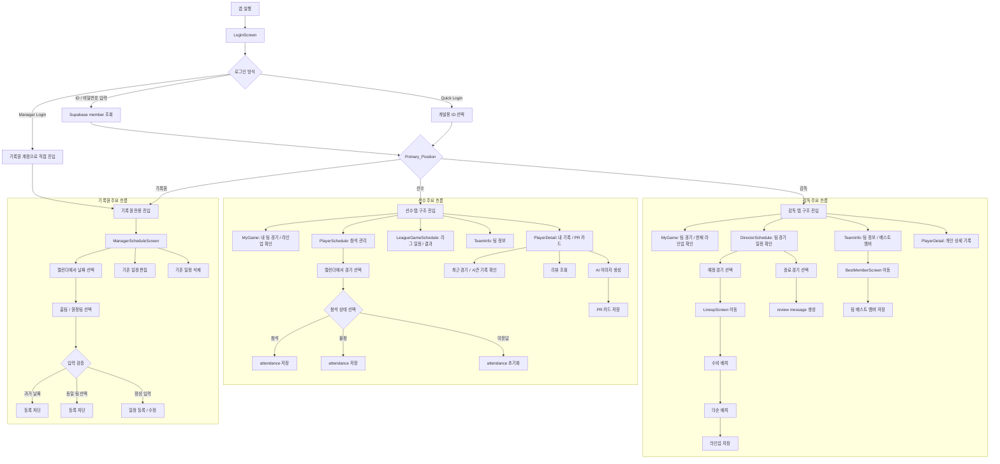
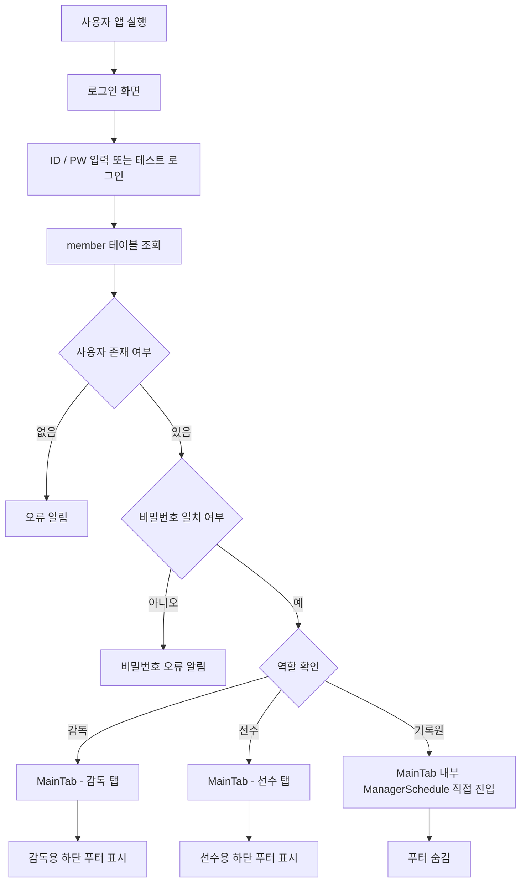
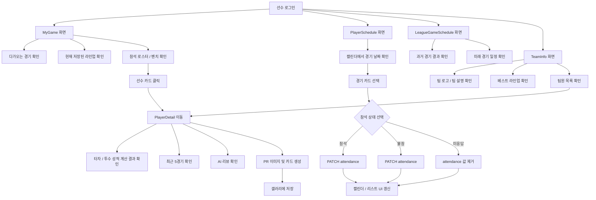
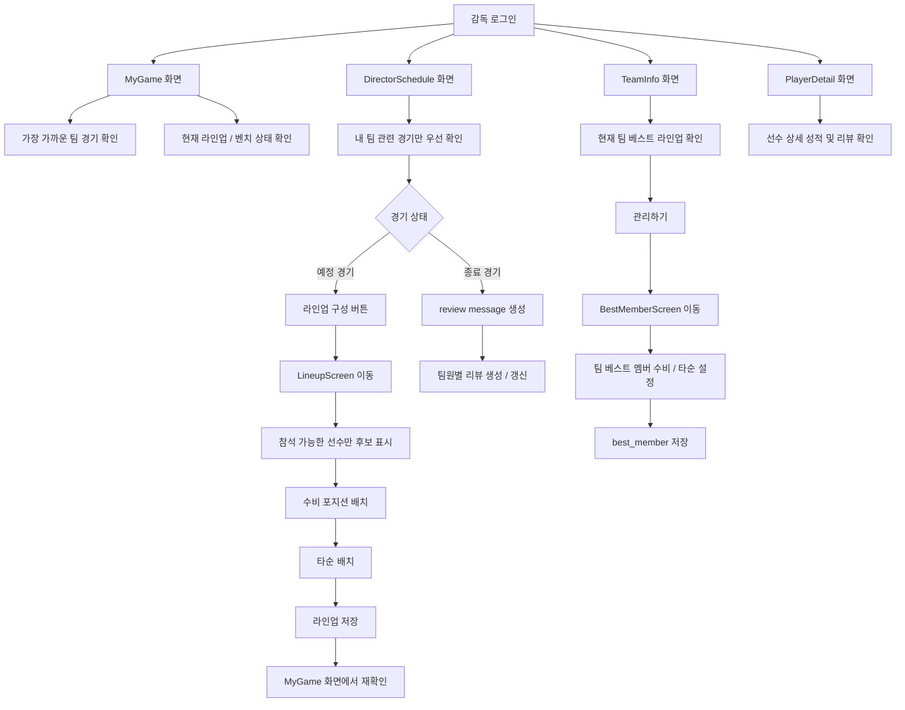
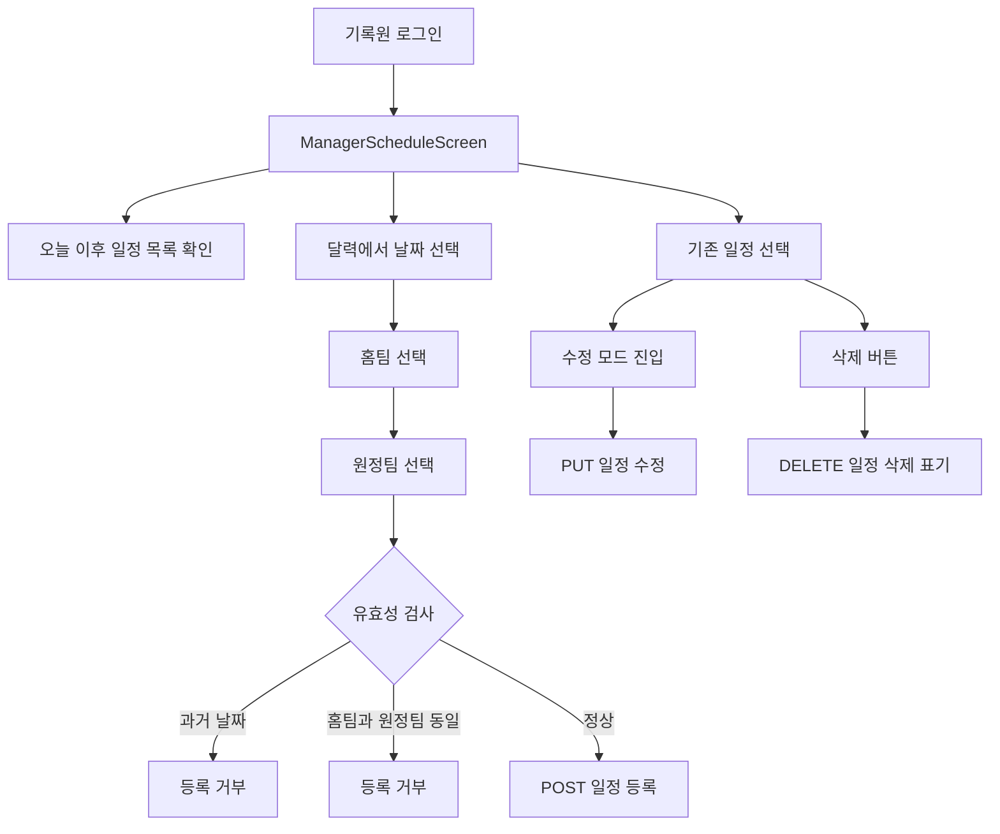
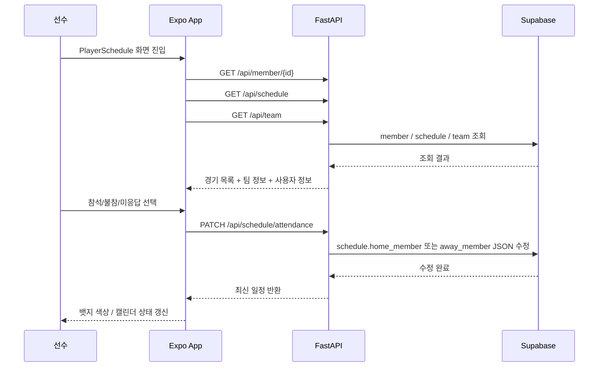
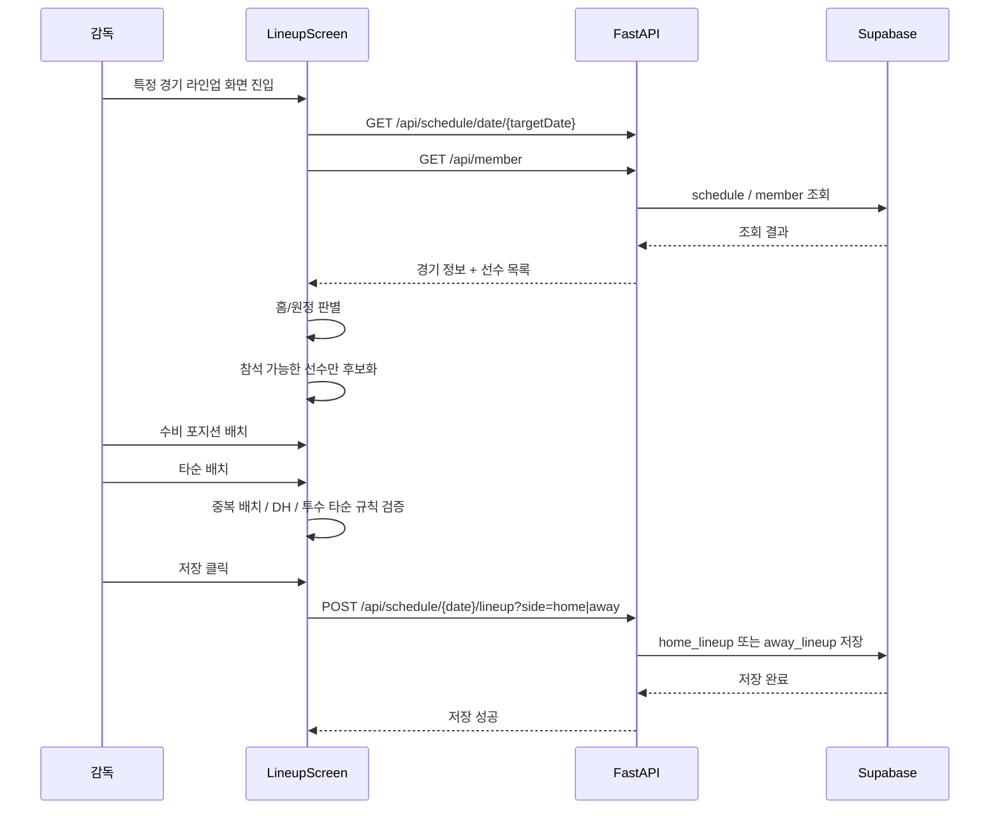
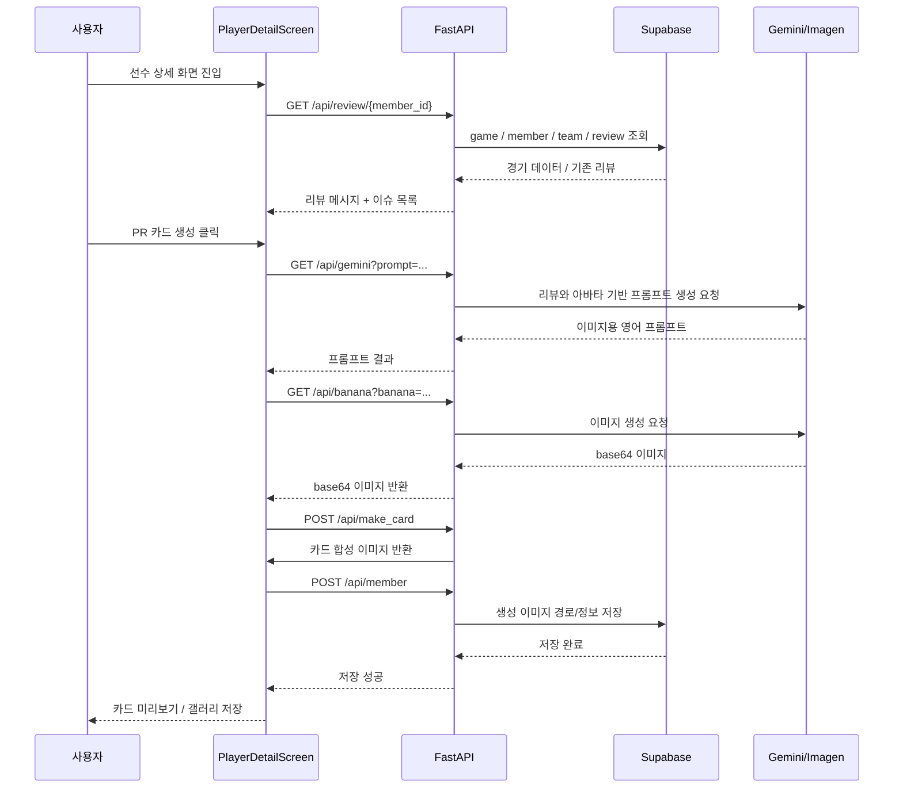
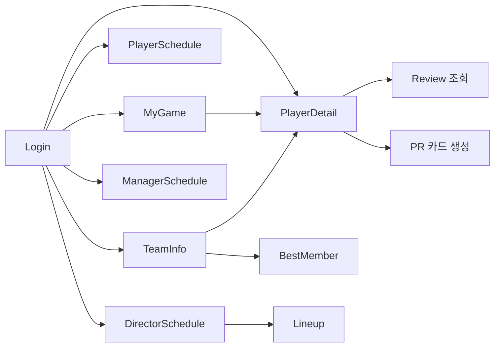

# BTS 앱 유저 플로우 정리 (Mermaid)

## 0. 전제

이 문서는 **현재 저장소의 구현 코드 기준**으로 작성했다.  
그래서 아래 두 가지는 구분해서 봐야 한다.

- **코드로 직접 확인된 흐름**
  - 로그인/역할 분기
  - 일정 조회
  - 참석/불참
  - 감독 라인업 구성
  - 팀 정보 / 베스트 멤버
  - 리뷰 생성
  - AI PR 카드 생성
- **기획 문서에는 있지만 현재 브랜치에서 UI까지 직접 확인되지 않은 흐름**
  - 앱 내부 CSV 업로드 화면
  - AI 라인업 추천

즉, 발표나 README에서는 **“기획”과 “현재 구현”을 분리해서 설명**하는 편이 정확하다.

---

## 1. 전체 서비스 흐름

---

## 2. 로그인 및 권한 분기 흐름

핵심 포인트:
- 권한 분기는 **로그인 직후 바로 발생**
- 역할에 따라 **탭 개수와 진입 화면이 달라짐**
- 기록원은 사실상 “일정 관리 전용 사용자”처럼 동작

---

## 3. 선수 유저 플로우

선수 입장에서 핵심 UX는 3개다.

1. **내가 어느 경기에서 뛸 수 있는지 먼저 표시한다.**
2. **감독이 저장한 라인업을 본다.**
3. **개인 기록과 AI 기반 PR 카드까지 소비한다.**

---

## 4. 감독 유저 플로우

감독 입장에서 핵심 UX는 4개다.

1. **참석 가능한 선수 확인**
2. **라인업 구성**
3. **팀 기준 베스트 멤버 관리**
4. **종료 경기 리뷰 생성**

---

## 5. 기록원 유저 플로우

현재 코드 기준으로 기록원 흐름은 **일정 CRUD** 중심이다.  
즉, 설명상 “리그 기록원 계정으로 일정 업로드” 문제를 풀기 위한 사용자로 이해할 수 있지만,  
실제 구현은 **수동 일정 등록/수정/삭제 도구**에 더 가깝다.

---

## 6. 참석 상태 업데이트 시스템 플로우

이 흐름이 BTS의 문제 해결 핵심이다.  
감독이 한 명씩 연락하지 않아도, 선수들이 먼저 상태를 표시하면 된다.

---

## 7. 감독 라인업 저장 시스템 플로우

이 플로우는 발표에서 보여주기 좋다.  
이유는 단순 CRUD가 아니라 **규칙 검증이 들어간 편성 로직**이기 때문이다.

---

## 8. AI 리뷰 + PR 카드 생성 플로우

주의:
- 이 기능은 **재미와 차별화 측면에서는 강함**
- 하지만 **핵심 문제 해결(참석/라인업)** 과의 직접 연결성은 `6/10` 정도다.
- 그래서 발표에서는 “핵심 기능” 뒤에 “확장 기능”으로 배치하는 편이 좋다.

---

## 9. 화면 간 관계를 더 압축해서 보면

---

## 10. 발표에서 이 플로우를 말할 때의 포인트

### 가장 먼저 말할 흐름 (`10/10`)
- 기록원이 경기 일정 등록
- 선수가 참석 여부 체크
- 감독이 참석 가능한 선수로 라인업 구성

### 두 번째로 말할 흐름 (`9/10`)
- 감독이 종료 경기 기준 리뷰 생성
- 선수 상세 화면에서 개인 기록과 리뷰 확인

### 마지막에 말할 확장 흐름 (`7/10`)
- PR 카드 생성
- 이미지 저장

이 순서를 추천하는 이유는 간단하다.

- 앞부분은 **문제 해결 핵심**
- 뒷부분은 **프로젝트의 개성과 확장성**

즉, 발표도 유저 플로우처럼  
**핵심 문제 해결 흐름 → 운영 보조 흐름 → 확장 기능 흐름**  
순서로 가는 편이 가장 자연스럽다.
