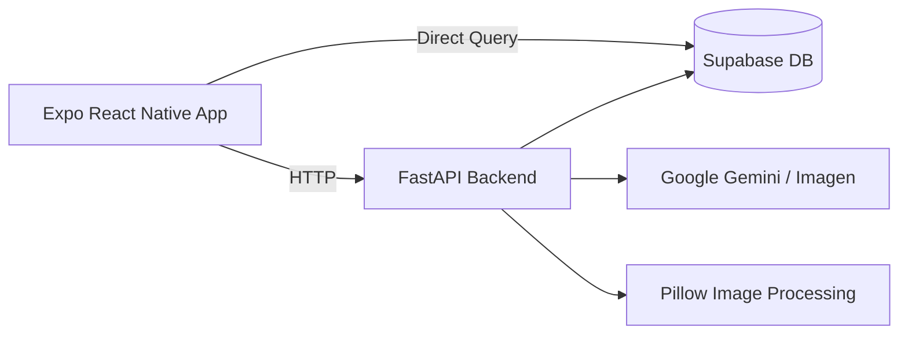

# BTS (Baseball Team System)

> 사회인 야구팀 운영에서 가장 번거로운 **경기 일정 공유 → 참석 여부 확인 → 라인업 구성** 흐름을 하나의 앱으로 줄이기 위한 프로젝트

---

## 프로젝트 소개

사회인 야구팀에서는 경기마다 감독이 선수 한 명 한 명에게 연락해서 참석 가능 여부를 확인하는 경우가 많다.  
특히 카카오톡 같은 메신저 중심 운영은 다음 문제가 반복된다.

- 경기 일정이 여기저기 흩어진다.
- 누가 참석 가능한지 한눈에 보기 어렵다.
- 감독이 라인업을 짜기 전까지 계속 사람을 확인해야 한다.
- 기록/정보/팀 운영 기능이 분리되어 있다.

**BTS(Baseball Team System)** 는 이 문제를 줄이기 위해 만든 모바일 앱이다.

핵심 아이디어는 단순하다.

1. 일정은 앱 안에서 관리한다.
2. 선수는 각 경기의 참석/불참 여부를 미리 표시한다.
3. 감독은 참석 가능한 선수만 보고 라인업을 구성한다.

---

## 이 저장소를 읽기 전에

이 README는 **현재 저장소의 실제 코드 기준**으로 작성했다.

즉, 아래를 구분했다.

- **현재 코드에서 직접 확인되는 기능**
  - 로그인/권한 분기
  - 선수 참석 관리
  - 감독 라인업 편성
  - 팀 정보 / 베스트 멤버
  - 경기/개인 기록 조회
  - AI 리뷰 / PR 카드 생성
  - 기록원 일정 CRUD
- **기획 문서에는 있으나 현재 브랜치에서 UI까지 완전히 확인되지 않은 항목**
  - 앱 내부 CSV 업로드 화면
  - AI 라인업 추천

그래서 발표나 문서에서도  
**“기획한 것”과 “현재 구현한 것”을 분리해서 설명하는 편이 정확하다.**

---

## 문제 정의

감독 입장에서는 “누가 뛸 수 있는가”를 파악하는 데 시간이 든다.  
선수 입장에서는 “언제 경기가 있고, 내가 나가는가”를 한눈에 보기 어렵다.  
기록원 입장에서는 일정이나 기록 반영 작업이 수동적이다.

BTS는 이 세 역할을 한 앱 안으로 모아 다음을 목표로 한다.

- 일정 확인 시간 단축
- 참석 확인 커뮤니케이션 비용 감소
- 감독의 라인업 편성 부담 감소
- 팀 정보와 기록의 일원화

---

## 핵심 기능

## 1) 선수 기능
- 내 팀 경기 및 다가오는 경기 확인
- 경기별 참석 / 불참 / 미응답 표시
- 내 팀 라인업 / 벤치 확인
- 팀 정보 및 팀원 확인
- 개인 성적, 최근 경기, 리뷰 확인
- AI PR 이미지 / 야구 카드 생성

## 2) 감독 기능
- 내 팀 경기 중심 일정 확인
- 참석 가능한 선수 기반 라인업 구성
- 수비 포지션 / 타순 저장
- 팀 베스트 멤버 관리
- 경기 종료 후 리뷰 메시지 생성

## 3) 기록원 기능
- 경기 일정 등록 / 수정 / 삭제
- 일정 관리 화면에서 캘린더 기반 일정 운영
- 백엔드 기준 CSV 업로드 endpoint 준비

---

## 역할별 핵심 시나리오

### 선수
1. 로그인한다.
2. `PlayerSchedule` 에서 경기별 참석 여부를 표시한다.
3. `MyGame` 에서 내 팀 경기와 라인업을 확인한다.
4. `PlayerDetail` 에서 개인 성적과 리뷰를 확인한다.

### 감독
1. 로그인한다.
2. `DirectorSchedule` 에서 내 팀 경기만 확인한다.
3. 예정 경기의 라인업을 구성한다.
4. `TeamInfo` 에서 팀 베스트 멤버를 관리한다.

### 기록원
1. 로그인한다.
2. `ManagerSchedule` 에서 날짜와 팀을 선택한다.
3. 경기를 등록 / 수정 / 삭제한다.

---

## 현재 구현 기준 아키텍처



핵심 특징:
- 앱은 일부 데이터를 **Supabase에 직접 조회**한다.
- 일정/라인업/리뷰/AI 기능은 **FastAPI를 통해 처리**한다.
- 즉, 현재 구조는 **직접 조회 + 백엔드 경유**가 혼합된 형태다.

---

## 기술 스택

### Frontend
- Expo
- React Native
- React Navigation
- `@supabase/supabase-js`
- `react-native-svg`
- `expo-media-library`
- `expo-file-system`

### Backend
- FastAPI
- Uvicorn
- Supabase Python SDK
- Pandas
- Python Multipart
- Google GenAI
- Pillow
- HTTPX

### Data
- Supabase

추정 주요 테이블:
- `member`
- `team`
- `schedule`
- `game`
- `review`

---

## 디렉터리 구조

```text
.
├─ app/                    # Expo React Native 모바일 앱
│  ├─ App.js               # 앱 진입점
│  ├─ navigation/          # 역할별 탭 / 스택 구성
│  ├─ components/          # 공통 헤더 / 푸터
│  ├─ screen/              # 화면별 UI와 로직
│  ├─ constants/           # API 주소, 출석/라인업 상수
│  ├─ lib/                 # Supabase client
│  └─ utils/               # 날짜, 일정, 참석 관련 유틸
├─ backend/                # FastAPI 서버
│  ├─ main.py              # API 엔드포인트 중심 파일
│  ├─ review_logic.py      # 리뷰 계산 로직
│  └─ review/              # 리뷰 관련 서비스/규칙/프롬프트
├─ BTS_project_overview.md # 프로젝트 기획 문서
├─ BTS_user_stories.md     # 유저 스토리
└─ implementation_plan.md  # CSV 업로드 설계 문서
```

---

## 주요 화면

### `LoginScreen`
- ID/PW 로그인
- 역할별 화면 분기
- Quick Login / Manager Login 제공

### `MyGameScreen`
- 다가오는 경기 요약
- 현재 라인업 / 벤치 표시
- 경기 로스터 확인

### `PlayerScheduleScreen`
- 캘린더 기반 참석 관리
- 참석 / 불참 / 미응답 저장

### `DirectorScheduleScreen`
- 감독 팀 경기만 강조
- 예정 경기 라인업 편성
- 종료 경기 리뷰 생성

### `LineupScreen`
- 수비 포지션 편성
- 타순 편성
- 중복 / DH / 투수 타순 규칙 검증

### `ManagerScheduleScreen`
- 일정 CRUD
- 날짜 / 홈팀 / 원정팀 선택
- 과거 날짜 차단

### `TeamInfoScreen`
- 팀 로고 / 설명
- 팀 베스트 라인업
- 팀원 목록

### `PlayerDetailScreen`
- 타자 / 투수 성적
- 최근 경기
- 리뷰 조회
- AI PR 카드 생성

---

## 로컬에서 실행하기

## 1. 백엔드 실행

```bash
cd backend
python -m venv .venv
source .venv/bin/activate   # Windows: .venv\Scripts\activate
pip install -r requirements.txt
uvicorn main:app --reload --host 0.0.0.0 --port 8000
```

필요 환경변수 예시:

```env
SUPABASE_URL=...
SUPABASE_KEY=...
GOOGLE_API_KEY=...
```

---

## 2. 프론트 실행

```bash
cd app
npm install
npx expo start
```

현재 코드 기준 주의사항:

- `app/constants/commonConstants.js` 에 `API_BASE_URL` 이 로컬 IP로 하드코딩되어 있다.
- `app/lib/supabase.js` 에 Supabase URL / Anon Key가 코드에 직접 들어 있다.
- 실제 팀 단위 테스트를 하려면 **같은 네트워크에서 백엔드 접근 가능**해야 한다.

---

## 현재 구조의 장단점

### 강한 점
- 문제 정의가 명확하다.
- 역할(감독/선수/기록원) 분리가 선명하다.
- 참석 관리 → 라인업 구성 흐름이 실제 문제와 직접 연결된다.
- `PlayerDetail` 의 AI PR 카드 기능으로 데모 임팩트가 있다.

### 약한 점
- 로컬 IP 하드코딩
- 환경변수 관리 미정리
- 앱 직접 Supabase 접근과 FastAPI 경유 방식이 혼합
- `backend/main.py` 에 기능이 많이 몰려 있음
- 현재 브랜치에서 CSV 업로드 UI는 직접 확인되지 않음

---

## 협업 방식

### 팀 구성
- `testwelltest01` — 최현석 (Scrum Master)
- `totsong2-max` — 송형철
- `DSanyC` — 최대산

### 스크럼
- 하루 1회
- 12시
- 약 5분

### 브랜치 전략 변화
초기:
- `main` 에서 각자 브랜치 생성
- 작업 후 `main` 으로 PR
- Scrum Master가 conflict 해결

후기:
- `dev` 브랜치 생성
- `dev` 에서 개인 브랜치 분기
- 개인 브랜치에 `dev` 를 merge 해서 충돌 정리
- 이후 `dev` 로 `squash and merge`

즉, 프로젝트 후반으로 갈수록 **협업 체계를 개선해 간 흔적**이 있다.

---

## 발표에서 강조하면 좋은 한 문장

> BTS는 사회인 야구팀 운영에서 가장 반복되는 수작업인  
> **일정 공유 → 참석 확인 → 라인업 구성** 을  
> **역할 기반 모바일 앱 흐름** 으로 바꾼 프로젝트다.

---

## 한계와 후속 과제

### 1. 운영형 배포 준비
- API 주소 환경변수화
- Supabase 설정 외부화
- `.env` 정리
- Linux 배포 호환성 점검

### 2. 구조 개선
- FastAPI 라우터/서비스 분리
- 인증/권한 처리 일원화
- 화면별 API 호출 로직 훅/서비스 레이어 분리

### 3. 기능 확장
- CSV 업로드 UI 연결
- AI 라인업 추천
- 푸시 알림
- 경기 마감 시간 정책
- 테스트 코드 및 CI/CD

---

## 프로젝트 점수표

- 문제 적합성: `9/10`
- MVP 완성도: `8/10`
- 데모 임팩트: `9/10`
- 배포 준비도: `4/10`
- 운영 안정성: `5/10`

---

## Contributors

- **최현석** — Scrum Master, 인증/네비게이션/통합/선수 상세/공통 구조
- **송형철** — 일정 CRUD, 라인업, 팀 정보, 감독 일정 화면
- **최대산** — 선수 일정, 리그 일정, MyGame, UI/UX, 리뷰 기능

자세한 기여 내역은 별도 문서에서 정리했다.
