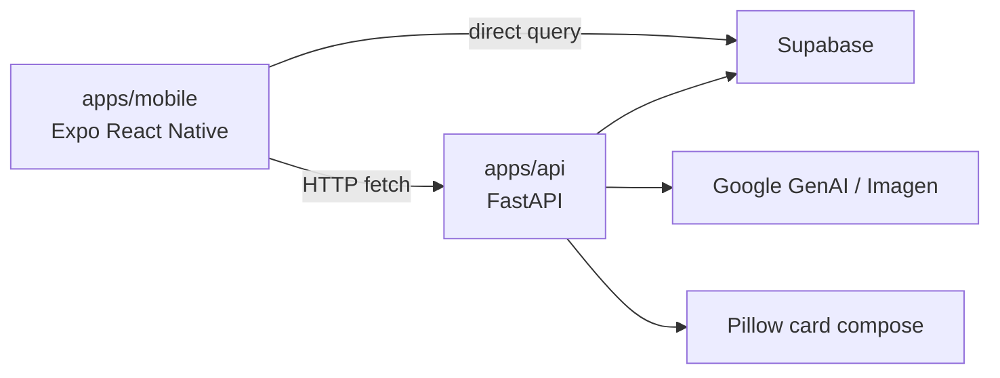

# BTS 프로젝트 구조 및 파일별 역할 분석

작성 기준: 2026-06-30, `D:\main` 작업트리 기준

이 문서는 현재 저장소의 폴더 구조를 파일 하나하나 수준으로 정리한 인벤토리 문서다. `.git/`, `node_modules/`, `.expo/`, 빌드 산출물, 가상환경, 캐시 폴더는 제외했고, 현재 작업트리에 존재하는 미추적 `report_md/` 폴더는 별도 표시했다.

> 주의: `.env`는 존재 여부와 역할만 기록한다. 민감값을 담을 수 있으므로 값 자체는 문서화하지 않는다.

## 1. 전체 구조 요약

BTS(Baseball Team System)는 사회인 야구팀 운영을 위한 모바일 앱, API 서버, Supabase DB 참고 자료, 프로젝트 문서를 한 저장소에 둔 단일 저장소 프로젝트다.

주요 실행 단위는 다음과 같다.

- `apps/mobile`: Expo React Native 모바일 앱
- `apps/api`: FastAPI 백엔드 서버
- `database/supabase`: Supabase SQL 참고 파일과 migration 후보
- `docs`: 기획, 보고서, 배포, 리팩토링 문서
- `report_md`: 개발 기록, 포트폴리오/커밋 분석, 와이어프레임 자료

현재 데이터 흐름은 완전히 단일화되어 있지는 않다. 모바일 앱은 일부 기능에서 Supabase를 직접 조회하고, 일정/라인업/리뷰/AI 카드 기능은 FastAPI를 경유한다.



## 2. 현재 전체 파일 트리

```text
D:\main
├─ .env
├─ .env.example
├─ .gitignore
├─ README.md
├─ pull_request_template.md
├─ apps/
│  ├─ api/
│  │  ├─ .env.example
│  │  ├─ main.py
│  │  ├─ requirements.txt
│  │  ├─ review_logic.py
│  │  └─ review/
│  │     ├─ prompts.py
│  │     ├─ rules.py
│  │     └─ service.py
│  └─ mobile/
│     ├─ .env.example
│     ├─ .gitignore
│     ├─ app.json
│     ├─ babel.config.js
│     ├─ index.js
│     ├─ metro.config.js
│     ├─ package-lock.json
│     ├─ package.json
│     ├─ assets/
│     │  ├─ adaptive-icon.png
│     │  ├─ baseballStadium.jpg
│     │  ├─ favicon.png
│     │  ├─ icon.png
│     │  └─ splash-icon.png
│     └─ src/
│        ├─ app/AppRoot.js
│        ├─ components/common/
│        │  ├─ CommonFooter.js
│        │  └─ CommonHeader.js
│        ├─ config/env.js
│        ├─ constants/scheduleConstants.js
│        ├─ features/
│        │  ├─ auth/screens/
│        │  │  ├─ LoginScreen.js
│        │  │  └─ LoginScreen.styles.js
│        │  ├─ lineups/screens/
│        │  │  ├─ BestMemberScreen.js
│        │  │  ├─ BestMemberScreen.styles.js
│        │  │  ├─ LineupScreen.js
│        │  │  └─ LineupScreen.styles.js
│        │  ├─ players/screens/
│        │  │  ├─ PlayerDetailScreen.js
│        │  │  └─ PlayerDetailScreen.styles.js
│        │  ├─ schedules/screens/
│        │  │  ├─ DirectorScheduleScreen.js
│        │  │  ├─ DirectorScheduleScreen.styles.js
│        │  │  ├─ LeagueGameScheduleScreen.js
│        │  │  ├─ LeagueGameScheduleScreen.styles.js
│        │  │  ├─ ManagerScheduleScreen.js
│        │  │  ├─ ManagerScheduleScreen.styles.js
│        │  │  ├─ MyGameScreen.js
│        │  │  ├─ MyGameScreen.styles.js
│        │  │  ├─ PlayerScheduleScreen.js
│        │  │  └─ PlayerScheduleScreen.styles.js
│        │  ├─ schedules/utils/scheduleUtils.js
│        │  └─ teams/screens/
│        │     ├─ TeamInfoScreen.js
│        │     └─ TeamInfoScreen.styles.js
│        ├─ navigation/MainTabNavigator.js
│        └─ services/supabaseClient.js
├─ database/
│  └─ supabase/
│     ├─ README.md
│     └─ migrations/0001_create_review_table.sql
├─ docs/
│  ├─ deployment/04_deployment_guide.md
│  ├─ planning/
│  │  ├─ BTS_project_overview.md
│  │  └─ BTS_user_stories.md
│  ├─ refactor/
│  │  ├─ project_restructure_plan.md
│  │  └─ project_structure.md
│  └─ reports/
│     ├─ 01_directory_structure.md
│     ├─ 02_user_flow_mermaid.md
│     ├─ 03_README.md
│     ├─ 05_technical_presentation_topics.md
│     ├─ 06_presentation_suggestions.md
│     ├─ 07_contributor_work_summary.md
│     └─ DESIGN.md
├─ report_md/
│  ├─ DevLog.md
│  ├─ choi_hyunseok_portfolio_problem_solving.md
│  ├─ dev_commit_history_detail.md
│  └─ wireframe/
│     ├─ 0.PNG
│     ├─ 1-1, 1-2, 1-3.PNG
│     ├─ 1-4, 1-5.PNG
│     ├─ 1-6, 1-7, 1-8.PNG
│     ├─ 2-1.PNG
│     ├─ 2-3.PNG
│     ├─ 2-4, 2-5.PNG
│     ├─ 2-6, 2-7, 2-8.PNG
│     ├─ 2-9, 2-10.PNG
│     └─ 3.PNG
└─ scripts/
   ├─ dev_api.sh
   └─ dev_mobile.sh
```

## 3. 루트 파일

| 파일 | 역할 |
| --- | --- |
| `.env` | 루트 로컬 환경 변수 파일이다. `.gitignore`에 의해 제외되며, 민감값을 담을 수 있어 값은 문서화하지 않는다. |
| `.env.example` | 모바일 공개 환경 변수와 API 서버 비공개 환경 변수 예시를 한 파일에 모은 루트 샘플이다. `EXPO_PUBLIC_API_BASE_URL`, `EXPO_PUBLIC_SUPABASE_URL`, `EXPO_PUBLIC_SUPABASE_ANON_KEY`, `SUPABASE_URL`, `SUPABASE_KEY`, `GOOGLE_API_KEY`를 안내한다. |
| `.gitignore` | 루트 제외 규칙이다. Node/빌드/coverage/Python venv/cache, macOS `.DS_Store`, `.env` 계열 파일을 제외하고 `.env.example`은 추적 가능하게 둔다. |
| `README.md` | 프로젝트 대표 안내 문서다. 개요, 기술 스택, 주요 기능, 현재 구조, 실행 방법, API 요약, 설정 주의사항, 개선 제안을 담는다. |
| `pull_request_template.md` | PR 작성용 템플릿이다. 변경 사항, 작업 목록, 스크린샷 항목을 제공한다. |

## 4. `apps/api` 백엔드

`apps/api`는 FastAPI 서버 실행 루트다. Supabase 접근, 일정/팀/멤버/라인업 API, 리뷰 생성, Google GenAI/Imagen 연동, Pillow 기반 카드 합성, CSV 업로드를 담당한다.

### 4.1 파일별 역할

| 파일 | 역할 |
| --- | --- |
| `apps/api/.env.example` | API 서버에 필요한 비공개 환경 변수 샘플이다. `SUPABASE_URL`, `SUPABASE_KEY`, `GOOGLE_API_KEY`를 안내한다. |
| `apps/api/requirements.txt` | Python 의존성 고정 파일이다. FastAPI, Uvicorn, Supabase Python SDK, pandas, python-multipart, Google GenAI, Pillow, HTTPX 등을 포함한다. |
| `apps/api/main.py` | FastAPI 앱의 중심 파일이다. 환경 변수 로드, CORS 설정, Supabase client 생성, Google GenAI client 생성, request model 정의, API route 등록, 이미지 카드 합성, CSV 업로드까지 담당한다. 현재 책임이 가장 많이 집중된 파일이다. |
| `apps/api/review_logic.py` | 실제 `main.py`가 import해서 사용하는 선수 리뷰 생성 로직이다. 타자/투수 지표 계산, 최근 경기와 baseline 비교, 이슈 문장 생성, 리뷰 upsert, 단일/팀/전체 리뷰 생성을 담당한다. |
| `apps/api/review/prompts.py` | 모듈화된 리뷰 서비스에서 사용할 리뷰 문장 생성 함수 `build_review_text()`를 제공한다. 현재 `review/service.py`가 사용한다. |
| `apps/api/review/rules.py` | 모듈화된 리뷰 서비스용 순수 규칙 파일이다. 타자/투수 지표 계산과 리뷰 이슈 탐지를 함수로 분리한다. |
| `apps/api/review/service.py` | 모듈화된 리뷰 서비스 레이어다. 멤버/팀/경기/기존 리뷰 조회, 리뷰 저장, 지표 계산, 프롬프트 조합을 담당한다. 현재 API 진입점은 `review_logic.py`를 사용하므로 이 파일은 차기 분리 구조 또는 대체 구현에 가깝다. |

### 4.2 `main.py` 주요 API

| Method | Endpoint | 역할 |
| --- | --- | --- |
| `GET` | `/` | 서버 root health 성격의 간단한 응답을 반환한다. |
| `GET` | `/api/schedule` | 삭제되지 않은 전체 일정을 날짜순으로 조회한다. |
| `POST` | `/api/schedule` | 새 일정을 등록한다. |
| `GET` | `/api/schedule/team/{team_id}` | 특정 팀이 홈/원정으로 포함된 일정을 조회한다. |
| `GET` | `/api/schedule/date/{date}` | 특정 날짜의 일정을 조회한다. |
| `PUT` | `/api/schedule/{date}` | 날짜 기준으로 일정의 날짜/홈팀/원정팀을 수정한다. |
| `DELETE` | `/api/schedule/{date}` | 물리 삭제 대신 `deleted_at`을 기록해 소프트 삭제한다. |
| `POST` | `/api/schedule/{date}/lineup` | `side=home|away`에 따라 `home_lineup` 또는 `away_lineup`을 저장한다. |
| `PATCH` | `/api/schedule/attendance` | 홈/원정 attendance JSON에서 선수 참석 상태를 참석/불참/미응답으로 갱신한다. |
| `GET` | `/api/member` | 전체 멤버를 조회한다. |
| `GET` | `/api/member/{user_id}` | 숫자 ID 또는 `User_ID` 기준으로 멤버를 조회한다. |
| `POST` | `/api/member` | 멤버 row를 업데이트한다. 현재 같은 경로의 함수가 두 번 정의되어 있어 정리가 필요하다. |
| `GET` | `/api/team` | 전체 팀을 조회한다. |
| `GET` | `/api/team/{team_id}` | 단일 팀 상세를 조회한다. |
| `POST` | `/api/team/{team_id}/best_member` | 팀의 고정 베스트 멤버 라인업을 저장한다. |
| `GET` | `/api/game` | 전체 경기 기록을 조회한다. |
| `GET` | `/api/review/{member_id}` | 선수 리뷰를 조회하거나 생성한다. |
| `POST` | `/api/review/generate-all` | 전체 선수 리뷰 생성을 실행한다. |
| `POST` | `/api/review/generate-by-date` | 특정 날짜/팀 기준 참가자 리뷰를 생성한다. |
| `GET` | `/api/gemini` | 선수/리뷰 정보를 바탕으로 Imagen용 영어 이미지 프롬프트를 생성한다. |
| `GET` | `/api/banana` | Imagen 이미지 생성을 호출하고 base64 JPEG를 반환한다. |
| `POST` | `/api/make_card` | AI 이미지, 선수 정보, 팀 정보, 성적을 합성해 야구 카드 이미지를 base64로 반환한다. |
| `POST` | `/upload-csv` | CSV를 cp949 또는 UTF-8로 읽어 Supabase `test` 테이블에 insert한다. |

### 4.3 백엔드 구조 관찰

- `main.py`에 route, schema, Supabase 접근, AI 호출, 이미지 처리, CSV 업로드가 집중되어 있다.
- import 중복이 있다.
- `@app.post("/api/member")`가 두 번 정의되어 있다.
- `ScheduleLineupUpdate` 모델은 정의되어 있지만 실제 라인업 endpoint는 `dict`를 직접 받는다.
- 카드 합성 폰트 경로가 `C:\Windows\Fonts\malgunbd.ttf`로 Windows에 맞춰져 있어 배포 환경에서는 fallback 가능성이 있다.
- `apps/api/review/`는 계층 분리 방향을 보여주지만, 실제 라우팅은 아직 `review_logic.py`에 연결되어 있다.

## 5. `apps/mobile` 모바일 앱

`apps/mobile`은 Expo React Native 앱 실행 루트다. React Navigation으로 로그인 이후 역할별 탭/스택 구조를 구성하고, Supabase와 FastAPI를 함께 사용한다.

### 5.1 앱 설정 및 실행 파일

| 파일 | 역할 |
| --- | --- |
| `apps/mobile/.env.example` | 모바일 앱에서 쓰는 Expo 공개 환경 변수 예시다. `EXPO_PUBLIC_API_BASE_URL`, `EXPO_PUBLIC_SUPABASE_URL`, `EXPO_PUBLIC_SUPABASE_ANON_KEY`를 안내한다. |
| `apps/mobile/.gitignore` | 모바일 앱 폴더 기준 제외 규칙이다. `node_modules`, `.expo`, web/native 빌드 산출물, debug 로그, local env, TypeScript build info, generated `ios`/`android` 폴더를 제외한다. |
| `apps/mobile/app.json` | Expo 앱 메타데이터 설정이다. 앱 이름/slug/version, portrait 방향, 아이콘, splash, Android adaptive icon, web favicon, `expo-asset` plugin을 정의한다. |
| `apps/mobile/babel.config.js` | Expo Babel 설정이다. `babel-preset-expo`를 사용한다. |
| `apps/mobile/index.js` | Expo JS 엔트리다. `registerRootComponent(AppRoot)`로 `src/app/AppRoot.js`를 앱 루트로 등록한다. |
| `apps/mobile/metro.config.js` | Metro bundler 설정이다. Expo 기본 설정에 `ts`, `tsx`, `svg` 확장자와 resolver main field 순서를 추가한다. |
| `apps/mobile/package.json` | 모바일 앱 package 정의다. `expo start`, `android`, `ios`, `web` scripts와 React Native, Expo, React Navigation, Supabase, SVG, FileSystem/MediaLibrary 의존성을 관리한다. |
| `apps/mobile/package-lock.json` | npm lockfile이다. 모바일 앱 의존성의 정확한 버전과 설치 트리를 고정한다. |

### 5.2 정적 자산

| 파일 | 역할 |
| --- | --- |
| `apps/mobile/assets/adaptive-icon.png` | Android adaptive icon foreground 이미지다. `app.json`에서 참조한다. |
| `apps/mobile/assets/baseballStadium.jpg` | 야구장 배경 이미지 자산이다. 현재 화면 스타일/배경 후보로 볼 수 있는 도메인 이미지다. |
| `apps/mobile/assets/favicon.png` | Expo web favicon 이미지다. `app.json`에서 참조한다. |
| `apps/mobile/assets/icon.png` | 앱 기본 아이콘 이미지다. `app.json`에서 참조한다. |
| `apps/mobile/assets/splash-icon.png` | 앱 splash 화면 이미지다. `app.json`에서 참조한다. |

### 5.3 공통 앱 골격

| 파일 | 역할 |
| --- | --- |
| `apps/mobile/src/app/AppRoot.js` | 앱 최상위 컴포넌트다. `SafeAreaProvider`, `NavigationContainer`, root Stack Navigator를 구성하고 `Login`과 `MainTab` 화면을 연결한다. |
| `apps/mobile/src/navigation/MainTabNavigator.js` | 로그인 후 핵심 내비게이션이다. Supabase에서 사용자 `Primary_Position`을 조회해 감독/선수/기록원 여부를 결정하고, 역할별 Tab/Stack 화면 구성을 다르게 렌더링한다. |
| `apps/mobile/src/components/common/CommonHeader.js` | 여러 화면에서 사용하는 상단 헤더다. 제목을 표시하고 특정 화면 제목일 때 로그아웃 버튼을 노출해 로그인 화면으로 navigation reset을 수행한다. |
| `apps/mobile/src/components/common/CommonFooter.js` | 커스텀 하단 탭 UI다. 사용자 직책에 따라 탭 목록을 만들고, Supabase에서 직책을 재조회하며, 현재 탭 강조와 navigation 이동을 담당한다. |
| `apps/mobile/src/config/env.js` | `EXPO_PUBLIC_API_BASE_URL`을 읽어 `API_BASE_URL`로 export한다. |
| `apps/mobile/src/services/supabaseClient.js` | Supabase JS client 생성 파일이다. `EXPO_PUBLIC_SUPABASE_URL`과 `EXPO_PUBLIC_SUPABASE_ANON_KEY`가 없으면 접근 시 명확한 오류를 던지는 proxy client를 반환한다. |
| `apps/mobile/src/constants/scheduleConstants.js` | 일정/팀/멤버/게임 API endpoint, 요일 라벨, 구장 링크, 참석 상태 옵션, 야구 포지션, 타순, 초기 라인업 구조를 모은 상수 파일이다. |

### 5.4 인증 기능

| 파일 | 역할 |
| --- | --- |
| `apps/mobile/src/features/auth/screens/LoginScreen.js` | 로그인 화면이다. Supabase `member` 테이블에서 `User_ID`, `User_PW`, `Primary_Position`을 조회해 클라이언트에서 비밀번호를 비교하고, 감독/선수/기록원 역할별로 `MainTab`에 진입시킨다. 시연용 quick login 선택 모달과 기록원 로그인 버튼도 포함한다. |
| `apps/mobile/src/features/auth/screens/LoginScreen.styles.js` | 로그인 화면 스타일이다. 배경, 입력 필드, 버튼, quick login picker, 모달 UI를 정의한다. |

### 5.5 일정 기능

| 파일 | 역할 |
| --- | --- |
| `apps/mobile/src/features/schedules/screens/MyGameScreen.js` | 로그인 사용자의 팀 경기와 라인업을 보여주는 허브 화면이다. 일정/팀/멤버 API를 조회해 현재 경기와 다가오는 경기, 수비 라인업, 벤치, 참석 로스터를 구성하고 선수 상세로 이동시킨다. |
| `apps/mobile/src/features/schedules/screens/MyGameScreen.styles.js` | 내 경기 화면 스타일이다. 로딩 상태, hero card, 경기 카드, 야구장 필드 배치, 선수/벤치 카드, 아바타 영역을 정의한다. |
| `apps/mobile/src/features/schedules/screens/PlayerScheduleScreen.js` | 선수용 일정 및 참석 관리 화면이다. 멤버/일정/팀 API를 조회하고 사용자 관련 일정만 정규화해 캘린더와 리스트로 보여준다. 참석/불참/미응답 변경 시 `PATCH /api/schedule/attendance`를 호출한다. |
| `apps/mobile/src/features/schedules/screens/PlayerScheduleScreen.styles.js` | 선수 일정 화면 스타일이다. 캘린더, 경기 카드, 참석 상태 badge, 참석 선택 버튼, 로딩/에러 UI를 정의한다. |
| `apps/mobile/src/features/schedules/screens/DirectorScheduleScreen.js` | 감독용 일정 화면이다. 감독의 팀을 조회하고 일정/팀/게임 API를 조합해 내 팀 경기 중심으로 예정/종료 경기를 표시한다. 예정 경기는 라인업 화면으로, 종료 경기는 리뷰 생성 API로 연결한다. |
| `apps/mobile/src/features/schedules/screens/DirectorScheduleScreen.styles.js` | 현재 빈 `StyleSheet`만 export하는 파일이다. 실제 감독 일정 화면은 `LeagueGameScheduleScreen.styles.js`를 import해 스타일을 공유한다. |
| `apps/mobile/src/features/schedules/screens/LeagueGameScheduleScreen.js` | 리그 전체 일정/결과 조회 화면이다. 일정/팀/게임 API를 병렬 조회하고 점수를 집계해 예정/종료 경기 탭, 월 캘린더, 경기 리스트를 렌더링한다. |
| `apps/mobile/src/features/schedules/screens/LeagueGameScheduleScreen.styles.js` | 리그 일정 화면과 감독 일정 화면이 공유하는 스타일이다. 캘린더, 탭, 경기 카드, 점수/상태 표시, load more 버튼, empty/error UI를 정의한다. |
| `apps/mobile/src/features/schedules/screens/ManagerScheduleScreen.js` | 기록원/관리자용 일정 CRUD 화면이다. Supabase에서 팀 목록을 조회하고, FastAPI 일정 API를 통해 일정 등록/수정/삭제를 수행한다. 월 캘린더, 팀 선택, 편집 상태, 삭제 확인 흐름을 포함한다. |
| `apps/mobile/src/features/schedules/screens/ManagerScheduleScreen.styles.js` | 관리자 일정 화면 스타일이다. 캘린더, 일정 등록 폼, 팀 선택 버튼, 일정 카드, 수정/삭제 버튼, loading indicator를 정의한다. |
| `apps/mobile/src/features/schedules/utils/scheduleUtils.js` | 일정 도메인 공통 유틸이다. JSON 필드 파싱, 날짜 변환/포맷팅, 캘린더 row 생성, 팀 이름 map, 참석 상태 계산, 일정 정규화, 멤버 fallback 조회, 일정 저장/삭제 API helper, 일정 폼 reset helper를 제공한다. |

### 5.6 라인업 기능

| 파일 | 역할 |
| --- | --- |
| `apps/mobile/src/features/lineups/screens/LineupScreen.js` | 감독이 특정 경기 라인업을 편성하는 화면이다. 날짜 기준 일정과 전체 멤버를 조회하고, 홈/원정 side를 판단해 `home_lineup` 또는 `away_lineup`을 불러온다. 수비 포지션, 타순, 벤치, DH/투수 타순 제한, 자동 후보 등록, 라인업 저장을 처리한다. |
| `apps/mobile/src/features/lineups/screens/LineupScreen.styles.js` | 경기 라인업 화면 스타일이다. 수비/타순 탭, 야구장 필드 카드, 포지션 슬롯, 로스터 카드, 포지션 버튼, 저장 버튼을 정의한다. |
| `apps/mobile/src/features/lineups/screens/BestMemberScreen.js` | 감독이 팀의 고정 베스트 멤버를 설정하는 화면이다. 전체 멤버와 팀 정보를 조회하고 `team.best_member`를 파싱해 수비/타순/벤치 구성을 편집한 뒤 `POST /api/team/{team_id}/best_member`로 저장한다. |
| `apps/mobile/src/features/lineups/screens/BestMemberScreen.styles.js` | 베스트 멤버 화면 스타일이다. 팀 헤더, 탭, 야구장 필드, 선수 선택 리스트, 배정 상태, 저장 버튼을 정의한다. |

### 5.7 선수 상세 기능

| 파일 | 역할 |
| --- | --- |
| `apps/mobile/src/features/players/screens/PlayerDetailScreen.js` | 선수 상세 화면이자 가장 큰 모바일 파일이다. Supabase에서 멤버/팀/게임 데이터를 직접 조회하고, 타자/투수 성적을 계산하며, 레이더 차트와 상세 지표를 표시한다. FastAPI 리뷰 조회, Gemini 프롬프트 생성, Imagen 이미지 생성, 멤버 사진 업데이트, 야구 카드 미리보기/저장 흐름도 포함한다. |
| `apps/mobile/src/features/players/screens/PlayerDetailScreen.styles.js` | 선수 상세 화면 스타일이다. 프로필 header, 타자/투수 mode toggle, 리뷰 카드, radar chart, stat card, PR 카드 생성/미리보기 modal, 저장 버튼 등을 정의한다. |

### 5.8 팀 기능

| 파일 | 역할 |
| --- | --- |
| `apps/mobile/src/features/teams/screens/TeamInfoScreen.js` | 팀 정보 화면이다. 전체 멤버와 현재 사용자의 팀 정보를 API로 조회하고, 팀 로고/설명, 베스트 멤버 필드, 팀원 로스터를 보여준다. 감독이면 베스트 멤버 설정 화면으로 이동할 수 있다. |
| `apps/mobile/src/features/teams/screens/TeamInfoScreen.styles.js` | 팀 정보 화면 스타일이다. 팀 정보 카드, 로고 영역, 베스트 라인업 야구장 필드, 로스터 grid, 선수 카드 스타일을 정의한다. |

### 5.9 모바일 구조 관찰

- 화면 파일은 기능 도메인별 `src/features/*/screens`로 이동된 상태다.
- 일정/캘린더/라인업 JSON 파싱은 일부 `scheduleUtils.js`로 모였지만, 각 화면 안에도 유사 로직이 남아 있다.
- `LineupScreen.js`와 `BestMemberScreen.js`는 수비/타순/벤치 배정 규칙이 유사하다.
- `DirectorScheduleScreen.js`와 `LeagueGameScheduleScreen.js`는 일정 정규화, 점수 집계, 캘린더/탭 UI가 많이 겹친다.
- 로그인, 역할 조회, 선수 상세 일부는 Supabase 직접 조회이고, 일정/리뷰/AI 기능은 FastAPI 경유라 데이터 접근 경계가 혼합되어 있다.

## 6. `database` DB 참고 파일

| 파일 | 역할 |
| --- | --- |
| `database/supabase/README.md` | Supabase SQL 참고 파일과 migration 후보의 목적을 설명한다. 현재는 수동 적용용 SQL 참고 파일에 가깝고, 운영형 migration 도구 도입 시 파일명 순서로 관리할 것을 안내한다. |
| `database/supabase/migrations/0001_create_review_table.sql` | `public.review` 테이블 생성 SQL이다. `member_id`, `date`, `mode`, `message`, `issues`, `baseline_metrics`, `recent_metrics`, 생성/수정 시각 컬럼을 만들고 `member_id/date` unique index와 `date` index를 정의한다. |

## 7. `docs` 문서 폴더

`docs`는 현재 구조에서 공식 문서 성격을 갖는 폴더다. 기획, 발표/보고서, 배포, 리팩토링 문서가 목적별로 나뉘어 있다.

| 파일 | 역할 |
| --- | --- |
| `docs/planning/BTS_project_overview.md` | 프로젝트 기획서다. 문제 정의, 사용자 역할, MoSCoW 우선순위, MVP, 화면 구성, 데이터 관리 초안을 정리한다. |
| `docs/planning/BTS_user_stories.md` | MVP 중심 유저스토리 문서다. 인증/권한, 경기 일정, 출석, 라인업, 선수 정보, 기록 관리, 대시보드 Epic과 스토리포인트를 담는다. |
| `docs/deployment/04_deployment_guide.md` | 배포 가이드다. 모바일/백엔드 분리 배포 관점, 환경 변수 외부화, Supabase 설정, Vercel/EAS 방향, 배포 전 수정 필요 항목을 정리한다. |
| `docs/refactor/project_restructure_plan.md` | 폴더 구조 개선과 리팩토링 계획 문서다. 실행 단위 분리, feature 구조, backend 계층화, migration/docs 위치, 단계별 이동 계획과 검증 체크리스트를 담는다. |
| `docs/refactor/project_structure.md` | 현재 문서다. 현재 작업트리 기준 전체 파일 구조와 파일별 역할을 정리한다. |
| `docs/reports/01_directory_structure.md` | 기존 디렉터리 구조 분석 보고서다. 작성 당시 구조와 현재 구조가 일부 다를 수 있어 과거 분석 자료로 보는 것이 안전하다. |
| `docs/reports/02_user_flow_mermaid.md` | 역할별 사용자 흐름과 시스템 흐름을 Mermaid 다이어그램으로 정리한 문서다. 로그인, 선수, 감독, 기록원, 참석, 라인업, AI 리뷰/카드 흐름을 설명한다. |
| `docs/reports/03_README.md` | 발표/보고서용 README 초안 성격의 문서다. 프로젝트 소개, 문제 정의, 기능, 아키텍처, 기술 스택, 실행/배포 관련 설명을 담는다. |
| `docs/reports/05_technical_presentation_topics.md` | 기술 발표 주제 후보 문서다. 역할 기반 앱 아키텍처, 참석에서 라인업으로 이어지는 흐름, 라인업 규칙, 혼합 아키텍처, AI 리뷰/카드 등을 발표 주제로 평가한다. |
| `docs/reports/06_presentation_suggestions.md` | 기술 외 발표 구성 제안서다. 발표 스토리라인, 슬라이드 구성, 데모 순서, 리스크 관리, 팀원별 발표 분배를 정리한다. |
| `docs/reports/07_contributor_work_summary.md` | 기여자별 작업 정리 문서다. 커밋 기반으로 작성자 매핑, 기능별 기여, 발표/보고서용 요약을 담는다. |
| `docs/reports/DESIGN.md` | Terra/Rooted Warmth 디자인 방향 문서다. 색상, 타이포그래피, elevation, 컴포넌트 규칙을 정리한다. |

## 8. `report_md` 추가 보고 자료

현재 `git status` 기준 `report_md/`는 미추적 폴더다. 그래도 작업트리에 존재하고 프로젝트 설명 자료로 의미가 있어 구조 분석에 포함한다.

| 파일 | 역할 |
| --- | --- |
| `report_md/DevLog.md` | 개발 노트다. 주제 선정, 데일리 스크럼, Agile/MoSCoW 메모, 화면 기획, 와이어프레임 이미지 연결, 개발 중 특이사항을 기록한다. |
| `report_md/choi_hyunseok_portfolio_problem_solving.md` | 최현석 커밋 기반 포트폴리오용 문제 해결 기여 정리 문서다. 프론트엔드, 백엔드, 협업/통합, 보안/설정/문서 관점의 기여와 면접 답변 초안을 담는다. |
| `report_md/dev_commit_history_detail.md` | dev 브랜치 전체 커밋 기반 상세 기여 정리 문서다. 작성자 ID 통합, 날짜별 흐름, 기여자별 상세, 기능 단위 형성 과정, 커밋 원장을 담는다. |

### 8.1 와이어프레임 이미지

| 파일 | 역할 |
| --- | --- |
| `report_md/wireframe/0.PNG` | `DevLog.md`에서 0p 로그인 화면으로 연결되는 와이어프레임 이미지다. |
| `report_md/wireframe/1-1, 1-2, 1-3.PNG` | 선수 화면 흐름 1-1p/1-2p/1-3p 와이어프레임 묶음이다. |
| `report_md/wireframe/1-4, 1-5.PNG` | 선수 화면 흐름 1-4p/1-5p 와이어프레임 묶음이다. |
| `report_md/wireframe/1-6, 1-7, 1-8.PNG` | 선수 화면 흐름 1-6p/1-7p/1-8p 와이어프레임 묶음이다. |
| `report_md/wireframe/2-1.PNG` | 감독 화면 흐름 2-1p 와이어프레임 이미지다. |
| `report_md/wireframe/2-3.PNG` | 감독 화면 흐름 2-3p 와이어프레임 이미지다. |
| `report_md/wireframe/2-4, 2-5.PNG` | 감독 화면 흐름 2-4p/2-5p 와이어프레임 묶음이다. |
| `report_md/wireframe/2-6, 2-7, 2-8.PNG` | 감독 화면 흐름 2-6p/2-7p/2-8p 와이어프레임 묶음이다. |
| `report_md/wireframe/2-9, 2-10.PNG` | 감독 화면 흐름 2-9p/2-10p 와이어프레임 묶음이다. |
| `report_md/wireframe/3.PNG` | 기록원 화면 흐름 3p 와이어프레임 이미지다. |

## 9. `scripts` 실행 보조 파일

| 파일 | 역할 |
| --- | --- |
| `scripts/dev_api.sh` | 루트에서 API 서버를 실행하기 위한 보조 스크립트다. `apps/api`로 이동해 `uvicorn main:app --reload --host 0.0.0.0 --port 8000`을 실행한다. |
| `scripts/dev_mobile.sh` | 루트에서 모바일 앱을 실행하기 위한 보조 스크립트다. `apps/mobile`로 이동해 `npm run start`를 실행한다. |

## 10. 구조상 우선 확인할 지점

1. 데이터 접근 경계
   - 로그인/역할/선수 상세 일부는 Supabase 직접 접근이고, 일정/리뷰/AI는 FastAPI 경유다.
   - 인증과 권한 검증을 어디에서 강제할지 먼저 정해야 한다.

2. 백엔드 책임 분리
   - `apps/api/main.py`가 API route, schema, service, external client, 이미지 처리까지 모두 포함한다.
   - `routes`, `schemas`, `services`, `clients` 계층으로 나누기 좋은 상태다.

3. 리뷰 로직 단일화
   - 실제 API는 `review_logic.py`를 사용한다.
   - `review/prompts.py`, `review/rules.py`, `review/service.py`는 더 모듈화된 방향이지만 현재 main route와 연결되지 않았다.

4. 모바일 중복 로직
   - 일정/캘린더 로직은 `PlayerScheduleScreen`, `DirectorScheduleScreen`, `LeagueGameScheduleScreen`, `ManagerScheduleScreen`에 반복된다.
   - 라인업 배정 규칙은 `LineupScreen`과 `BestMemberScreen`에 반복된다.
   - 선수 상세 화면은 데이터 조회, 지표 계산, AI 생성, 파일 저장, UI 렌더링이 한 파일에 모여 있다.

5. 문서와 실제 구조 차이
   - `docs/reports/01_directory_structure.md`와 일부 오래된 보고 문서는 과거 `app/`, `backend/` 구조를 기준으로 설명하는 부분이 남아 있다.
   - 현재 기준으로는 `apps/mobile`, `apps/api`, `database`, `docs` 구조를 우선해야 한다.

6. 작업트리 상태
   - `report_md/`는 현재 미추적 폴더로 보인다.
   - 추적할 문서라면 Git에 추가하고, 임시 산출물이라면 `.gitignore` 또는 보관 위치를 정해야 한다.

## 11. 실행 진입점 요약

백엔드:

```bash
cd apps/api
pip install -r requirements.txt
uvicorn main:app --reload --host 0.0.0.0 --port 8000
```

모바일:

```bash
cd apps/mobile
npm install
npm run start
```

루트 보조 스크립트:

```bash
./scripts/dev_api.sh
./scripts/dev_mobile.sh
```
